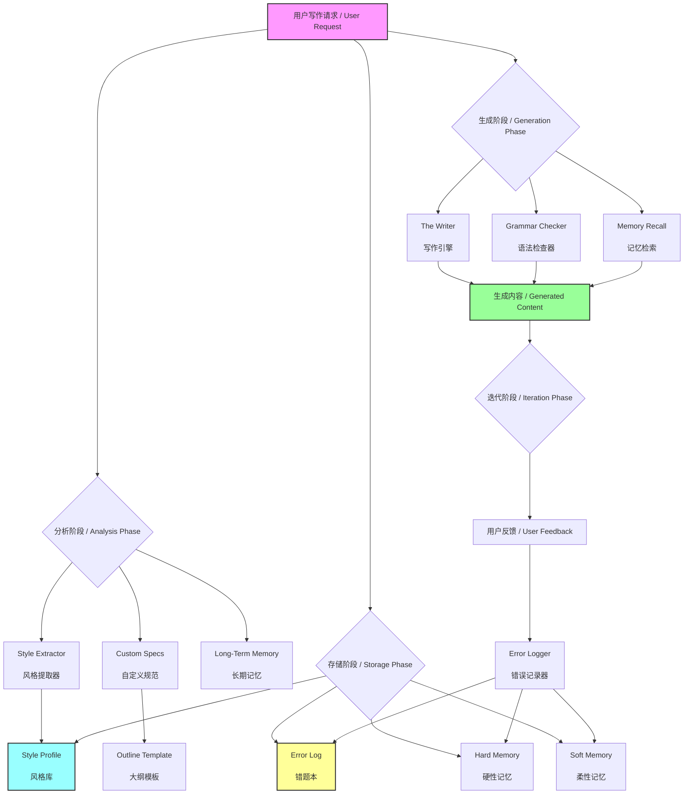

# AI Vibe Writing Skill / AI 写作风格迁移助手

> An AI Skill that provides "Style Transfer" and "Error Memory" capabilities for personalized writing.
> 
> 一个具备“风格迁移”和“错误记忆”功能的 AI 写作助手，打造你专属的“影子写手”。

## 🌟 What's New / 更新日志

**v1.2 - Long-Term Memory / 长期记忆**
Added domain-based hard/soft memory to preserve precise terms and user preferences.
新增按领域划分的硬性/柔性记忆，用于精准术语与偏好存储。

**v1.1 - Grammar & Spell Checker / 语法与拼写检查器**
Added a dedicated module to detect and correct grammatical errors and typos in both English and Chinese.
新增了专用的语法与拼写检查模块，支持中英文双语纠错。

## 🧠 Why I Exist / 设计初衷
本工程（AI-Vibe-Writing-Skills）的初衷，是跳出 “AI 替代创作” 的误区，聚焦于AI 的辅助价值
将写作从重复、机械的 “dirty work”（如素材整理、格式规范、基础校对、灵感初步筛选等）中解放出来，把精力聚焦在创意构思、内容深度打磨、风格个性化等核心环节，最终实现更高效率、更高质量的内容生产。

## 🧩 Core Capabilities / 核心功能

### 🎭 STYLE TRANSFER / 风格迁移
**Mimic**: Analyzes your past writings to extract "Style DNA".  
**Consistency**: Maintains your unique tone, sentence structure, and vocabulary.  
**原理**: 分析过往文章提取“风格指纹”，保持语调、句式和用词的一致性。

### 🧠 ERROR MEMORY / 错误记忆
**Learning**: Remembers your corrections and "Don'ts".  
**Avoidance**: Automatically checks against the "Error Log" before writing.  
**原理**: 记住你的纠正和禁忌，在生成前自动查阅“错题本”以避免重犯。

### 📝 GRAMMAR CHECK / 语法检查
**Quality**: Built-in bilingual grammar and spell checker.  
**Review**: Identifies typos and awkward phrasing without changing your style.  
**原理**: 内置中英文双语语法检查，识别错别字和语病，同时保留原有风格。

### 🧠 LONG-TERM MEMORY / 长期记忆
**Hard Memory**: Stores exact terms, units, and key values by domain.  
**Soft Memory**: Stores preferences, phrasing, and tone by domain.  
**原理**: 硬性记忆用于术语、单位、关键数值的精确存储；柔性记忆用于偏好与表达习惯的持续适配。

### ⚙️ CUSTOMIZATION / 自定义规范
**Context**: Adapts to specific audiences (e.g., Technical, General) and topics.  
**Outline**: Manages structure for long-form content.  
**原理**: 自动适配目标受众和主题，支持长文大纲管理。

##  How to Start / 如何开始使用

You can activate this system immediately by following these steps:
你可以立即尝试以下步骤来“激活”这个系统：

### Step 1: Style Extraction / 提取风格
Provide 3-5 of your past high-quality writings to the AI.
把你的 3-5 篇过往高质量文章发给 AI，并说：

> "Please use the **Style Extractor** to analyze these texts and update `style_profile.md`."
>
> “请使用 **Style Extractor** 分析这些文章，并更新 `style_profile.md`。”

### Step 2: Customization / 配置规范
Open `.ai_context/custom_specs.md` and fill in your common writing context.
你可以打开 `.ai_context/custom_specs.md`，填入你常用的写作背景，这样我每次写作都会自动适配这些背景。

Example / 例如：
- **Audience / 受众**: Technical Beginners / 技术小白
- **Domain / 领域**: Artificial Intelligence / 人工智能

### Step 3: The Writer / 日常写作
Just give a task. No need to repeat complex prompts.
直接发布任务即可，无需每次重复 Prompt。

> "Based on my style, write an introduction to RAG technology."
>
> “基于我的风格写一篇关于 RAG 技术的介绍。”

*I will automatically read `style_profile.md` to mimic your tone and check `error_log.md` to avoid taboos.*
*我会自动读取 `style_profile.md` 模仿你的语气，并检查 `error_log.md` 避开禁忌。*

### Step 4: Error Logger / 纠错迭代
If I make a mistake (e.g., use a word you dislike), correct me immediately.
如果我犯了错（比如用了你不喜欢的词），直接告诉我：

> "Don't use the word 'delve'. Add this to my error log."
>
> “不要用‘delve’这个词，把它加入错题本。”

*I will automatically update `error_log.md` to ensure I don't make the same mistake again.*
*我会自动更新 `error_log.md`，保证下次不再犯。*

### Step 5: Long-Term Memory / 长期记忆
Provide durable domain facts or preferences to store.
提供稳定的领域事实或偏好以便长期存储：

> "In medical writing, always use mmol/L for glucose. Save this as hard memory."
>
> “在医学领域，葡萄糖单位固定使用 mmol/L，作为硬性记忆存储。”

---

## 📂 File Structure / 文件结构

- **`.ai_context/`**: The brain of the system.
  - `style_profile.md`: Your style fingerprint.
  - `error_log.md`: Your negative constraints.
  - `custom_specs.md`: User-defined writing context.
  - `outline_template.md`: Template for structuring content.
  - `memory/hard_memory.json`: Domain hard memory (terms, units, key values).
  - `memory/soft_memory.json`: Domain soft memory (preferences, phrasing, tone).
  - `prompts/`: Core logic prompts (Style Extractor, Writer, Error Logger, Grammar Checker, Long-Term Memory).
- **`.traerules`**: System instructions ensuring the workflow is followed.

## 🗺️ Functional Structure / 功能结构

**Core Logic / 核心逻辑**: 
**分析（提取风格） -> 存储（建立风格库与错题本） -> 生成（RAG 检索增强） -> 迭代（更新错题本）**

**Workflow Explanation / 流程说明**:
1. **Analysis**: The system analyzes user-provided samples and domain context to extract style traits and memory candidates.
2. **Storage**: Hard memory and soft memory are stored by domain alongside the style profile and error log.
3. **Generation**: The Writer retrieves relevant hard/soft memory to ensure accuracy and tone alignment, while the Grammar Checker ensures quality.
4. **Iteration**: User feedback updates both the error log and long-term memory to improve future outputs.

## 📈 Star History

## 📄 License

This project is licensed under the [MIT License](./LICENSE).
