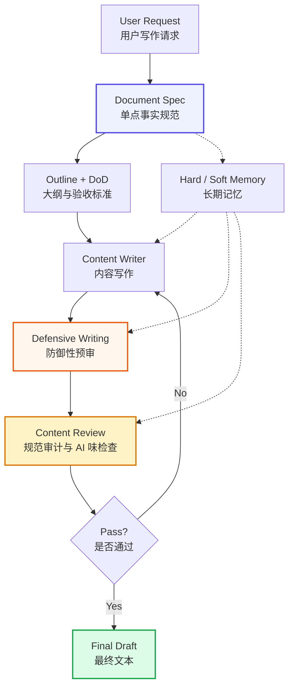
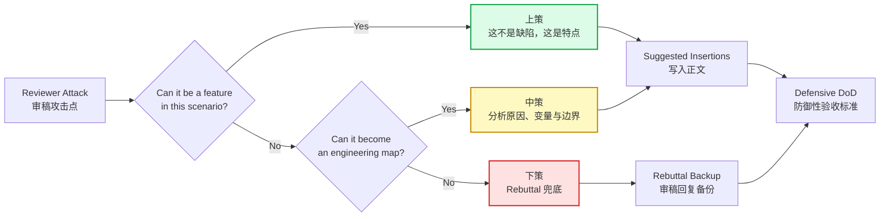

# AI Vibe Writing Skills / AI 写作技能系统

[](https://opensource.org/licenses/MIT)

> A local AI writing skill system for style transfer, long-term memory, spec-driven writing, reviewer-defense, PDF evidence ingestion, and multi-agent academic writing.
>
> 一个面向 Agent / IDE 的本地 AI 写作技能系统，支持风格迁移、长期记忆、规范驱动写作、审稿防御、PDF 证据入库与多智能体学术写作闭环。

## Table of Contents / 目录

- [What This Project Is / 项目定位](#what-this-project-is--项目定位)
- [What Is New / 最新能力](#what-is-new--最新能力)
- [Core Workflow / 核心工作流](#core-workflow--核心工作流)
- [Quick Start / 快速开始](#quick-start--快速开始)
- [Agent System / 智能体体系](#agent-system--智能体体系)
- [Defensive Writing / 防御性写作](#defensive-writing--防御性写作)
- [Configuration / 配置入口](#configuration--配置入口)
- [Automation Workflows / 自动化工作流](#automation-workflows--自动化工作流)
- [PDF And Evidence / PDF 与证据入库](#pdf-and-evidence--pdf-与证据入库)
- [Local AI Style Check / 本地 AI 痕迹检测](#local-ai-style-check--本地-ai-痕迹检测)
- [File Structure / 文件结构](#file-structure--文件结构)
- [Usage Examples / 使用示例](#usage-examples--使用示例)
- [License / 许可证](#license--许可证)

## What This Project Is / 项目定位

AI Vibe Writing Skills 不是一个传统的 Web 应用或后端服务。它是一套放在本地仓库里的 **AI 写作上下文系统**：Agent 打开这个项目后，会读取 `.ai_context` 里的提示词、风格档案、错题本、长期记忆、文档规范和工作流，从而把一次普通写作任务变成可追踪、可复核、可迭代的写作工程。

它的设计目标不是让 AI 替代作者，而是把写作中的 dirty work 交给 AI：

- 整理资料与参考文献
- 提取和保持个人写作风格
- 记录用户不喜欢的表达方式
- 管理长期术语、单位、事实和偏好
- 先制定写作规范，再写大纲和正文
- 在投稿前预判审稿人的攻击面
- 检查 AI 味、证据覆盖、规范偏离和 LaTeX 编译问题

一句话概括：

> 这是一个让 AI 成为“影子写手 + 审稿红队 + 证据管家 + 格式工程师”的本地技能包。

## What Is New / 最新能力

### v1.9 - Defensive Writing Agent / 防御性写作智能体

新增 `defensive-writing-agent`，用于投稿前的审稿人红队式预审。

核心思想：

> 防御性写作 = 贡献边界管理 + 局限主动披露 + 审稿人误解预防

它不是让作者嘴硬，也不是把局限藏起来，而是把论文的贡献、边界、证据和局限讲清楚，让审稿人即使挑刺，也只能挑到“适用边界”或“未来工程优化”，而不是动摇核心创新。

该模块内置三层策略：

| Strategy / 策略 | Core Logic / 核心逻辑 | Use Case / 适用场景 |
| :--- | :--- | :--- |
| 上策 | 这不是缺陷，这是特点 | 所谓短板与目标场景、威胁模型或使用约束天然一致 |
| 中策 | 缺点本身是贡献边界分析 | 问题是真实局限，但来自工程参数或部署条件 |
| 下策 | Rebuttal 兜底 | 前两者都不成立，或审稿意见已经出现 |

### v1.8 - Next-Gen Architecture / 下一代动态架构

- `11_context_compactor_agent.md`: 长上下文压缩，提取核心论点骨架、风格快照和已决规范。
- `12_router_agent.md`: 动态 Prompt 路由，根据章节和文件类型挂载不同提示词切片。
- `13_latex_self_healing_agent.md`: LaTeX 编译自愈，通过日志分析、脚本修复和重编译闭环解决复杂错误。

### Earlier Modules / 已有模块

- 风格迁移：从用户过往文章中提取写作风格 DNA。
- 错误记忆：把用户纠正转化为可复用的负面约束。
- 语法检查：中英文语法、拼写、标点和风格洁癖项检查。
- 长期记忆：按领域存储硬性事实和柔性偏好。
- PDF 阅读：解析论文、抽取摘要、方法、结果、术语、数据点和引用。
- 多智能体闭环：大纲管理、内容写作、防御性预审、内容检阅。

## Core Workflow / 核心工作流

本系统采用 Spec-Driven Writing，也就是“先定义事实和边界，再写正文”。


```mermaid
flowchart TD
    A["User Request<br/>用户写作请求"] --> B["Document Spec<br/>单点事实规范"]
    B --> C["Outline + DoD<br/>大纲与验收标准"]
    C --> D["Content Writer<br/>内容写作"]
    D --> E["Defensive Writing<br/>防御性预审"]
    E --> F["Content Review<br/>规范审计与 AI 味检查"]
    F --> G{"Pass?<br/>是否通过"}
    G -->|Yes| H["Final Draft<br/>最终文本"]
    G -->|No| D

    B -.-> M["Hard / Soft Memory<br/>长期记忆"]
    M -.-> D
    M -.-> E
    M -.-> F

    style B fill:#eef2ff,stroke:#4f46e5,stroke-width:2px
    style E fill:#fff7ed,stroke:#ea580c,stroke-width:2px
    style F fill:#fef3c7,stroke:#d97706,stroke-width:2px
    style H fill:#dcfce7,stroke:#16a34a,stroke-width:2px
```

### Workflow Contract / 流程契约

1. **Spec Definition / 规范制定**: 生成或读取 `document_spec.md`，明确主题、目标、核心论点、证据要求和防御性写作约束。
2. **Outline / 大纲规划**: 使用 `outline_template.md` 生成带 `definition_of_done` 和 `defensive_dod` 的大纲。
3. **Recall / 记忆召回**: 读取 `style_profile.md`、`error_log.md`、硬性记忆、柔性记忆和参考文献库。
4. **Draft / 正文写作**: `content-writer-agent` 根据 Spec、大纲、风格和证据生成正文。
5. **Defend / 防御性预审**: `defensive-writing-agent` 识别审稿攻击面，执行上策、中策、下策选择。
6. **Review / 检阅审计**: `content-review-agent` 检查 Spec、DoD、Defensive DoD、AI 味、证据覆盖和心流质量。
7. **Iterate / 迭代修正**: 若失败，回到写作阶段；若用户纠错，更新错题本和长期记忆。

## Quick Start / 快速开始

### Step 0: Clone / 克隆项目

```bash
git clone https://github.com/donghuixin/AI-Vibe-Writing-Skills.git
cd AI-Vibe-Writing-Skills
```

将该文件夹作为工作区打开，例如 Trae、Cursor、VS Code、Claude Code 或 Antigravity。

### Step 1: Fill Custom Specs / 配置写作背景

编辑 [.ai_context/custom_specs.md](./.ai_context/custom_specs.md)，填写常用主题、目标读者、引用要求、检测阈值、防御性写作设置等。

建议至少填写：

- `Topic`
- `Target Audience`
- `Writing Mode`
- `Evidence Requirements`
- `Defensive Writing Settings`

### Step 2: Extract Your Style / 提取个人风格

首次使用建议提供 3-5 篇高质量旧作，然后对 Agent 说：

> Use style-extractor to analyze these texts and update `.ai_context/style_profile.md`.

系统会提取：

- 语气和句式节奏
- 高频词和禁用词
- 标题习惯
- 引用与举例方式
- 标点和中英文混排习惯

### Step 3: Start Writing / 开始写作

简单任务可直接调用 Writer：

> Use content-writer-agent to draft an introduction about RAG based on my style.

长文或论文建议使用完整闭环：

> Use workflow-coordinator to draft section 2 with outline, defensive writing, and review.

投稿前建议单独运行防御性预审：

> Use defensive-writing-agent to red-team the Discussion section before submission.

## Agent System / 智能体体系

| Agent | File | Role |
| :--- | :--- | :--- |
| Style Extractor | [.ai_context/prompts/1_style_extractor.md](./.ai_context/prompts/1_style_extractor.md) | 提取用户写作风格 DNA |
| Writer | [.ai_context/prompts/2_writer.md](./.ai_context/prompts/2_writer.md) | 按风格、错题本、记忆和证据生成文本 |
| Error Logger | [.ai_context/prompts/3_error_logger.md](./.ai_context/prompts/3_error_logger.md) | 把用户纠正沉淀为长期规则 |
| Grammar Checker | [.ai_context/prompts/4_grammar_checker.md](./.ai_context/prompts/4_grammar_checker.md) | 检查语法、错别字、标点和风格洁癖项 |
| Long-Term Memory | [.ai_context/prompts/5_long_term_memory.md](./.ai_context/prompts/5_long_term_memory.md) | 管理硬性事实和柔性偏好 |
| Outline Manager | [.ai_context/prompts/6_outline_manager_agent.md](./.ai_context/prompts/6_outline_manager_agent.md) | 创建、存储、校验大纲与 DoD |
| Content Writer | [.ai_context/prompts/7_content_writer_agent.md](./.ai_context/prompts/7_content_writer_agent.md) | 在大纲和 Spec 约束下写作 |
| Content Review | [.ai_context/prompts/8_content_review_agent.md](./.ai_context/prompts/8_content_review_agent.md) | 检查 AI 味、证据覆盖、规范偏离和心流质量 |
| Workflow Coordinator | [.ai_context/prompts/9_workflow_coordinator.md](./.ai_context/prompts/9_workflow_coordinator.md) | 调度完整写作闭环 |
| PDF Reader | [.ai_context/prompts/10_pdf_reader_agent.md](./.ai_context/prompts/10_pdf_reader_agent.md) | 读取 PDF 并抽取结构化证据 |
| Context Compactor | [.ai_context/prompts/11_context_compactor_agent.md](./.ai_context/prompts/11_context_compactor_agent.md) | 压缩长上下文，保留核心论点和风格快照 |
| Router | [.ai_context/prompts/12_router_agent.md](./.ai_context/prompts/12_router_agent.md) | 根据章节和文件类型动态挂载 Prompt 切片 |
| LaTeX Self-Healing | [.ai_context/prompts/13_latex_self_healing_agent.md](./.ai_context/prompts/13_latex_self_healing_agent.md) | 通过日志分析和脚本修复 LaTeX 编译问题 |
| Defensive Writing | [.ai_context/prompts/14_defensive_writing_agent.md](./.ai_context/prompts/14_defensive_writing_agent.md) | 审稿攻击面预审与三策防御 |

## Defensive Writing / 防御性写作

防御性写作模块是 v1.9 的核心新增能力。它专门处理学术审稿中最常见的问题：审稿人抓住局限，试图把局限上升为核心贡献不成立。

它的目标不是“反驳审稿人”，而是在正文阶段提前完成三件事：

1. 讲清核心贡献是什么。
2. 讲清哪些限制只是适用边界或工程变量。
3. 讲清为什么这些限制不动摇核心创新。

### Three-Tier Strategy / 上中下三策


```mermaid
flowchart LR
    A["Reviewer Attack<br/>审稿攻击点"] --> B{"Can it be a feature<br/>in this scenario?"}
    B -->|Yes| U["上策<br/>这不是缺陷，这是特点"]
    B -->|No| C{"Can it become<br/>an engineering map?"}
    C -->|Yes| M["中策<br/>分析原因、变量与边界"]
    C -->|No| L["下策<br/>Rebuttal 兜底"]

    U --> D["Suggested Insertions<br/>写入正文"]
    M --> D
    L --> E["Rebuttal Backup<br/>审稿回复备份"]
    D --> F["Defensive DoD<br/>防御性验收标准"]
    E --> F

    style U fill:#dcfce7,stroke:#16a34a,stroke-width:2px
    style M fill:#fef9c3,stroke:#ca8a04,stroke-width:2px
    style L fill:#fee2e2,stroke:#dc2626,stroke-width:2px
```

| Strategy | Meaning | Example |
| :--- | :--- | :--- |
| 上策 | 把所谓缺陷解释为场景适配的特点 | 通信距离近意味着短距交互、更低窃听风险、更小攻击面 |
| 中策 | 把真实局限分析为工程优化边界 | 长距离受天线、功率、遮挡和干扰影响，本文贡献是速率机制 |
| 下策 | 为审稿意见准备克制回复 | 承认当前范围，补证据、降级 claim 或说明未来实验 |

### Attack Surface Taxonomy / 十类审稿攻击面

| Attack Type | Reviewer Concern | Defensive Direction |
| :--- | :--- | :--- |
| 实验距离 / 实验范围不足 | 距离太短、场景太理想 | 判断能否上策化为安全、近场、低暴露面特点；否则分析距离扩展边界 |
| 样本规模不足 | 样本、设备、场景或实验次数太少 | 明确样本角色是 proof-of-concept、controlled validation 还是 population-level evidence |
| Baseline 不足或不公平 | 没有强 baseline，或比较条件不一致 | 说明同约束比较域，列出 closest prior、practical baseline、excluded baseline rationale |
| 消融实验不足 | 不知道提升来自哪个模块 | 区分可消融组件和耦合机制，用 controlled variant 或敏感性分析补足 |
| 泛化性不足 | 只在单一数据集、平台或场景有效 | 写清已验证范围和合理外推条件，不做无限泛化 |
| 统计显著性不足 | 没有 error bar、置信区间或多次运行 | 没有统计支撑时降级为 observed / measured improvement |
| 部署成本过高 | 复杂、贵、难集成 | 拆分 compute、hardware、integration、calibration、maintenance cost |
| 能耗问题 | 速率提升是否靠更高功耗 | 明确 energy per bit、duty cycle、active time、transmission power |
| 实时性 / 延迟不足 | 吞吐提升不等于低延迟 | 区分 throughput、latency、tail latency、jitter、packet loss |
| 理论新颖性不足 | 只是工程优化或组合已有技术 | 先声明贡献类型：method、system、dataset、theory、benchmark 或 concept feasibility |

### Output Contract / 输出契约

`defensive-writing-agent` 必须输出：

- `Reviewer Attack Surface`: 审稿人可能攻击的点
- `Core Contribution Boundary`: 核心贡献与非核心变量
- `Strategy Ladder`: 每个攻击点使用上策、中策还是下策
- `Defensive Framing Plan`: 每个风险点如何写进正文
- `Suggested Insertions`: 可直接插入论文的段落或句子
- `Rebuttal Backup`: 若审稿人真的提出，该如何回应
- `Defensive DoD`: 当前章节必须满足的防御性验收标准

### Defensive DoD / 防御性验收标准

- 是否把核心贡献说清楚了？
- 该局限是否会被误读为核心实验失败？
- 是否说明局限影响的是部署边界，而不是创新有效性？
- 是否先尝试上策，而不是直接进入 rebuttal？
- 若上策不成立，是否用中策分析原因、优化变量和边界？
- 是否有证据锚点或明确范围条件？
- 是否避免了夸张词、绝对化断言和过度承诺？
- 审稿人只读这一段时，能否明白为什么这个问题不致命？

## Configuration / 配置入口

### Custom Specs

[.ai_context/custom_specs.md](./.ai_context/custom_specs.md) 是全局配置入口，包含：

- 写作主题和目标读者
- 引用数量与格式
- 上下文预算
- AI 味检测阈值
- 心流鉴赏阈值
- 防御性写作设置
- PDF 阅读设置
- 第三方检测服务 API Key 占位符

防御性写作相关字段：

```markdown
- **Defensive Writing Settings**:
  - **Target Venue**: [e.g. NeurIPS, CHI, MobiCom, Nature, IEEE Journal]
  - **Contribution Type**: [e.g. method, system, dataset, theory, benchmark, concept_feasibility]
  - **Known Weaknesses**: [e.g. short-range evaluation, limited sample size, missing energy study]
  - **Reviewer Sensitivity**: [e.g. novelty, baselines, statistics, deployment, reproducibility]
  - **Strategy Preference**: [e.g. upper_first]
  - **Allow Feature Reframing**: [e.g. true]
  - **Require Engineering Boundary Analysis**: [e.g. true]
  - **Generate Rebuttal Backup**: [e.g. true]
```

### Document Spec

[.ai_context/document_spec_template.md](./.ai_context/document_spec_template.md) 是大型写作任务的单点事实模板。它用于明确：

- 主题和目标
- 目标读者
- 核心论点
- 章节结构
- 证据要求
- 防御性写作约束
- 必须降级或加范围条件的 claim

### Memory

| File | Purpose |
| :--- | :--- |
| [.ai_context/style_profile.md](./.ai_context/style_profile.md) | 用户风格指纹 |
| [.ai_context/error_log.md](./.ai_context/error_log.md) | 错题本与禁忌表达 |
| [.ai_context/memory/hard_memory.json](./.ai_context/memory/hard_memory.json) | 术语、单位、关键事实 |
| [.ai_context/memory/soft_memory.json](./.ai_context/memory/soft_memory.json) | 偏好、语气、表达习惯 |
| [.ai_context/memory/reference_library.json](./.ai_context/memory/reference_library.json) | 参考文献与证据库 |

## Automation Workflows / 自动化工作流

Antigravity 或支持 `.agents/workflows` 的 Agent IDE 可以直接使用以下工作流：

| Command | File | Purpose |
| :--- | :--- | :--- |
| `/ai_vibe_writing` | [.agents/workflows/ai_vibe_writing.md](./.agents/workflows/ai_vibe_writing.md) | 完整执行 Spec、Outline、Write、Defend、Review |
| `/defensive_writing` | [.agents/workflows/defensive_writing.md](./.agents/workflows/defensive_writing.md) | 单独执行审稿攻击面预审 |
| `/pdf_ingestion` | [.agents/workflows/pdf_ingestion.md](./.agents/workflows/pdf_ingestion.md) | 读取 PDF 并更新参考文献库和长期记忆 |

## PDF And Evidence / PDF 与证据入库

PDF 阅读模块用于把论文、报告或技术文档转为结构化证据。

标准流程：

1. 读取 `.ai_context/custom_specs.md` 中的 PDF Reading Settings。
2. 使用内置解析或 MinerU 解析 PDF。
3. 调用 `pdf-reader-agent` 抽取摘要、方法、结果、局限、术语、数据点和引用格式。
4. 更新 `reference_library.json`。
5. 将稳定术语和事实写入 hard memory，将写作偏好写入 soft memory。

相关文件：

- [.ai_context/prompts/10_pdf_reader_agent.md](./.ai_context/prompts/10_pdf_reader_agent.md)
- [.ai_context/pdf_ingestion_template.md](./.ai_context/pdf_ingestion_template.md)
- [.ai_context/reference_learning.md](./.ai_context/reference_learning.md)
- [.ai_context/scripts/parse_pdf.py](./.ai_context/scripts/parse_pdf.py)

### MinerU

仓库包含 MinerU 相关示例：

- [mineru_gui.py](./mineru_gui.py): Gradio 图形界面。
- [run_magic_pdf.py](./run_magic_pdf.py): 命令行调用示例。
- [magic-pdf.json](./magic-pdf.json): magic-pdf 配置示例。
- [configs/layoutlmv3_base_inference.yaml](./configs/layoutlmv3_base_inference.yaml): layoutlmv3 推理配置。

示例：

```bash
python mineru_gui.py
```

或：

```bash
magic-pdf -p ./test.pdf -o ./output -m txt
```

## Local AI Style Check / 本地 AI 痕迹检测

[Local_AI_Style_Check](./Local_AI_Style_Check) 提供完全本地运行的 LaTeX 论文 AI 痕迹检测工具。

功能：

- 清洗 LaTeX 源码，移除公式、引用、标签和注释。
- 扫描中英文高频 AI 味词。
- 使用 distilgpt2 计算困惑度 PPL。
- 适合投稿前检查论文中的机械表达和 AI 润色痕迹。

安装：

```bash
cd Local_AI_Style_Check
pip install -r requirements.txt
python paper_ai_detector.py
```

## File Structure / 文件结构

```text
.
├── README.md
├── SKILLS.md
├── FREE_AI_DETECTION_APIS.md
├── .traerules
├── .agents/
│   └── workflows/
│       ├── ai_vibe_writing.md
│       ├── defensive_writing.md
│       └── pdf_ingestion.md
├── .ai_context/
│   ├── custom_specs.md
│   ├── document_spec_template.md
│   ├── outline_template.md
│   ├── style_profile.md
│   ├── error_log.md
│   ├── reference_learning.md
│   ├── pdf_ingestion_template.md
│   ├── memory/
│   │   ├── hard_memory.json
│   │   ├── soft_memory.json
│   │   └── reference_library.json
│   ├── prompts/
│   │   ├── 1_style_extractor.md
│   │   ├── 2_writer.md
│   │   ├── 3_error_logger.md
│   │   ├── 4_grammar_checker.md
│   │   ├── 5_long_term_memory.md
│   │   ├── 6_outline_manager_agent.md
│   │   ├── 7_content_writer_agent.md
│   │   ├── 8_content_review_agent.md
│   │   ├── 9_workflow_coordinator.md
│   │   ├── 10_pdf_reader_agent.md
│   │   ├── 11_context_compactor_agent.md
│   │   ├── 12_router_agent.md
│   │   ├── 13_latex_self_healing_agent.md
│   │   └── 14_defensive_writing_agent.md
│   └── scripts/
│       └── parse_pdf.py
├── Local_AI_Style_Check/
│   ├── README.md
│   ├── requirements.txt
│   └── paper_ai_detector.py
├── mineru_gui.py
├── run_magic_pdf.py
├── create_pdf.py
├── magic-pdf.json
└── configs/
    └── layoutlmv3_base_inference.yaml
```

## Usage Examples / 使用示例

### Simple Writing / 简单写作

> Based on my style profile, write an introduction to RAG for technical beginners.

### Long-Form Writing / 长文写作

> Use outline-manager-agent and content-writer-agent to create a three-level outline and draft section 2.

### Defensive Writing / 防御性写作

> Use defensive-writing-agent to red-team the Experiment and Discussion sections. The core contribution is BLE throughput improvement, but the current experiments are short-range.

Expected output:

- Reviewer Attack Surface
- Core Contribution Boundary
- Strategy Ladder
- Defensive Framing Plan
- Suggested Insertions
- Rebuttal Backup
- Defensive DoD

### PDF Ingestion / PDF 入库

> Use pdf-reader-agent to read this PDF, extract evidence, and update reference_library.json.

### Error Logging / 错题本更新

> Do not use "delve" or "in summary". Add this to my error log.

### Memory Update / 长期记忆更新

> In medical writing, always use mmol/L for glucose. Save this as hard memory.

## Recommended Setup For Academic Papers / 学术论文推荐配置

1. Fill `custom_specs.md` with venue, contribution type, evidence requirements, and defensive writing settings.
2. Create `document_spec.md` from `document_spec_template.md`.
3. Use PDF ingestion to build `reference_library.json`.
4. Use outline-manager-agent to create outline with DoD and Defensive DoD.
5. Use content-writer-agent to draft.
6. Use defensive-writing-agent before final review.
7. Use content-review-agent for Spec Audit, Defensive Audit, AI tone, evidence coverage, and flow appraisal.
8. Use latex-self-healing-agent if LaTeX compilation fails.

## Design References / 设计参考

The defensive writing taxonomy is inspired by common academic review criteria:

- [NeurIPS Paper Checklist](https://neurips.cc/public/guides/PaperChecklist)
- [ECCV Contribution Types](https://eccv.ecva.net/Conferences/2026/ReviewerContributionTypes)
- [AAAI Reproducibility Checklist](https://aaai.org/conference/aaai/aaai-23/reproducibility-checklist/)
- [ACM SIGSOFT Empirical Standards](https://www2.sigsoft.org/EmpiricalStandards/)

## Roadmap / 后续模块

Planned advanced writing modules:

- **Defensive Writing / 防御性写作**: completed in v1.9.
- **Essence Inquiry / 本质探究**: planned.
- **Flow Guidance / 心流引导**: planned as an advanced module beyond the existing flow appraisal checks.

## License / 许可证

This project is released under the [MIT License](./LICENSE).
