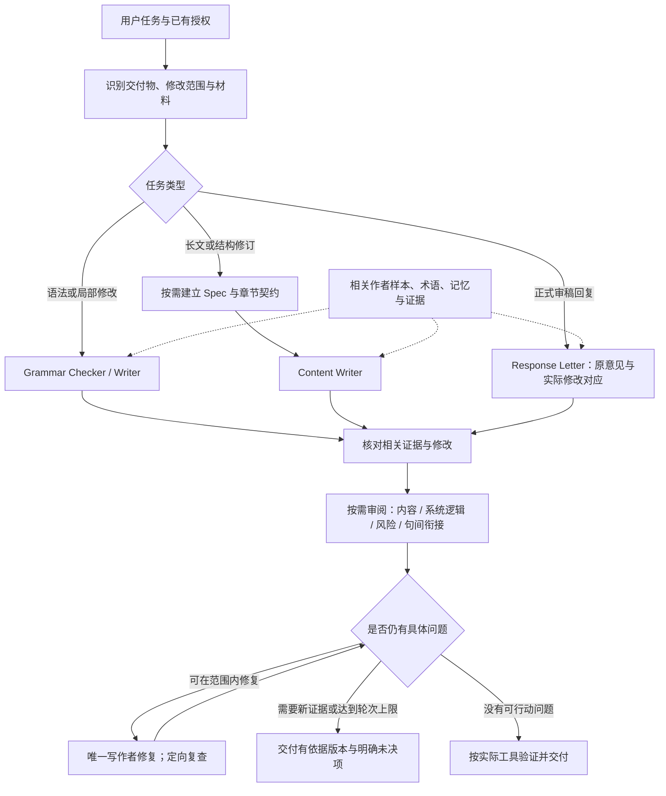

# AI Vibe Writing Skills / AI 写作技能系统

[](LICENSE)

> Academic writing skills for author voice, evidence-based arguments, sentence flow, and reviewer responses.
>
> 面向 Agent / IDE 的本地写作技能包：把作者习惯、论文证据和修稿记录保存在文件中，让多轮写作继续使用同一份上下文。

本手册包含安装、配置、角色选择、写作流程、审稿回复、PDF 阅读和本地工具用法。从 [SKILL.md](SKILL.md) 进入，全部角色及模板见 [SKILLS.md](SKILLS.md)。已有论文工程继续使用原目录与构建方式；私人稿件、审稿意见和研究记录保存在作者的论文工作区。

## 目录

- [项目定位](#项目定位)
- [最新能力与历史模块](#最新能力与历史模块)
- [核心工作流](#核心工作流)
- [详细快速开始](#详细快速开始)
- [角色体系](#角色体系)
- [作者语气与风格学习](#作者语气与风格学习)
- [句间推理与阅读衔接](#句间推理与阅读衔接)
- [系统论文论证与证据](#系统论文论证与证据)
- [防御性写作](#防御性写作)
- [正式 Reviewer Response](#正式-reviewer-response)
- [配置入口](#配置入口)
- [记忆与反馈](#记忆与反馈)
- [兼容工作流入口](#兼容工作流入口)
- [PDF 阅读与证据入库](#pdf-阅读与证据入库)
- [MinerU 辅助工具](#mineru-辅助工具)
- [Local Style Lint 本地工具](#local-style-lint-本地工具)
- [文件结构](#文件结构)
- [使用案例](#使用案例)
- [学术论文推荐流程与验收](#学术论文推荐流程与验收)
- [验证与故障排查](#验证与故障排查)
- [设计来源](#设计来源)
- [迁移说明](#迁移说明)
- [Roadmap](#roadmap)
- [License](#license)

## 项目定位

AI Vibe Writing Skills 是一组保存在本地仓库中的提示词、模板、工作流入口和可选脚本。Agent 根据当前任务读取相应资源，帮助作者完成资料整理、写作、修订和验证。它不需要启动 Web 服务，也不会在打开文件夹后自动运行所有角色。

适合以下工作：

- 从作者自己的文本学习用词、论证和体裁习惯，在后续修改中保留这些习惯。
- 保持术语、单位、条件、公式和引用一致，记录作者纠正及其适用范围。
- 对长文先明确目标、材料、章节职责和验收条件，再按所需阶段起草。
- 检查系统论文的问题、洞察、设计、实现、实验和边界是否相互支持。
- 找出句间缺失的关系、无铺垫的话题转换、重复结论及错误的动作执行者。
- 预审贡献与局限，完成正式审稿回复，核对实际要求和已完成修改。
- 阅读 PDF、定位参考证据，并根据实际日志处理 LaTeX 编译问题。

作者负责研究判断与最终取舍；Agent 承担可定位、可复查的编辑工作。事实以原始材料和核验来源为据，Spec 和记忆保存约定与记录。局部语法修改可以直接完成，复杂章节才需要更多规划或独立审阅。

“减少 AI 味”在这里指修复具体的冗余、歧义、空泛解释和模板表达，不指推断作者身份、优化检测器分数或保证论文录用。术语重复、被动语态、`A/An` 开头和某个词语本身都不是判错依据。

## 最新能力与历史模块

### 当前更新：2026-09-13

- **保留系统论文论证框架。** 15 号角色继续使用 C/H/D/E/B、证据状态、章节契约和领域检查；response 与内容审计引用同一套 ID，避免不同角色生成不同口径。
- **作者语气带来源。** 区分作者原稿、合著稿、编辑稿、他人范文和来源不明文本；分开保存作者确认、样本推断和普通编辑建议。论文正文与 response letter 分体裁学习。
- **正式 response letter。** 16 号角色从完整决定信和原评论恢复要求，区分询问、明确要求与可选路径，核对回复和稿件修改状态。
- **句间推理与衔接。** 17 号角色检查相邻句段的话题、语法主语、实际施事者和信息关系，允许合理的主语切换。包含[修复及无需修改的合成示例](docs/sentence-flow-examples.md)。
- **按任务选流程。** 语法、段落润色、系统逻辑和正式回复各有入口；缺少配置不阻塞已有材料支持的局部修改。
- **本地风格检查可解释。** Local Style Lint 返回文件位置、片段与原因，不下载语言模型，不计算 AI 作者概率，不自动改稿。旧命令文件名仍保留。
- **验证状态分开。** 源码检查、编译、PDF 视觉检查和科学证据核验分别记录；合成试用与确定性工具测试也分别报告。

### v1.9：防御性写作

历史 v1.9 引入 14 号 Defensive Writing，补充贡献边界、局限和审稿风险分析。当前保留这些目标，并按实际证据选择澄清、纠正、收窄、补证据或有依据地不同意。旧版“上策／中策／下策”不再是必须顺序执行的阶梯；真实局限可以直接承认，也可能影响核心结论。

### v1.8：上下文、路由与 LaTeX

- **11 · Context Compactor**：长任务交接时保留目标、来源、有效决策、作者偏好和未完成项。
- **12 · Router**：根据交付物和修改范围选择相关提示词，控制无关上下文。
- **13 · LaTeX Self-Healing**：读取实际日志，做最小修复，重编译并检查输出；没有引擎时如实说明未编译。

### 已有基础模块

1–10 号角色覆盖风格提取、句段写作、错误记录、语法检查、长期记忆、大纲、章节写作、内容审阅、流程协调和 PDF 阅读。原编号与文件路径保留，可继续单独调用。新增角色扩展这些能力，不要求用户重建已有论文工作区。

## 核心工作流

采用按任务展开的 Spec-Driven Writing：先明确当前目标、材料和边界，再决定需要哪些阶段。Spec 是写作约定，原始数据和核验来源决定研究事实。已经明确的一句话修改无需新建完整 Spec。


```mermaid
flowchart TD
    A[用户任务与已有授权] --> B[识别交付物、修改范围与材料]
    B --> C{任务类型}
    C -->|语法或局部修改| D[Grammar Checker / Writer]
    C -->|长文或结构修订| E[按需建立 Spec 与章节契约]
    E --> F[Content Writer]
    C -->|正式审稿回复| G[Response Letter：原意见与实际修改对应]
    D --> H[核对相关证据与修改]
    F --> H
    G --> H
    M[相关作者样本、术语、记忆与证据] -.-> D
    M -.-> F
    M -.-> G
    H --> I[按需审阅：内容 / 系统逻辑 / 风险 / 句间衔接]
    I --> J{是否仍有具体问题}
    J -->|可在范围内修复| K[唯一写作者修复；定向复查]
    K --> J
    J -->|需要新证据或达到轮次上限| L[交付有依据版本与明确未决项]
    J -->|没有可行动问题| N[按实际工具验证并交付]
```

### 各阶段如何运转

1. **确定任务与材料。** 识别文件、段落、版本和输出格式；阅读必要的前后文、作者要求及证据。只审阅时保持源文件不变。
2. **按需规划。** 新长文或结构调整使用 Document Spec 和 Outline；系统论文复用 C/H/D/E/B。局部编辑跳过不必要的建档和大纲。
3. **召回相关上下文。** 读取同体裁风格、相关错误记录、术语、证据和已确认决策。缺来源的事实不能自动升级为已核验。
4. **写作或答复。** 章节用 Content Writer，句段用 Writer，真实审稿意见优先用 Response Letter。正文技术叙述与内部编辑说明分开。
5. **检查关键问题。** 根据任务选 Content Review、Systems Paper Logic、Defensive Writing 或 Sentence Flow。先处理事实和逻辑，再处理措辞。
6. **独立审阅与裁决。** 实质改写需要且可调用子代理时，一名作者编辑最终稿，审阅者只拿原稿、同版候选、约束及证据，返回定位问题。作者核对来源后裁决；没有子代理时明确为同一作者顺序检查。
7. **定向修复。** 针对具体缺口和新修改复查，不为“提高分数”反复重写。最大修订轮次见项目配置，达到上限仍有问题就说明，不能声称通过。
8. **验证与交付。** 核对数值、范围、引用和修改状态；LaTeX 工程可用时沿用原构建命令并查看 PDF。交付请求的文件或意见，以及实际未完成的检查。

DoD（Definition of Done）记录本次任务可检查的完成条件，例如“解释 D1 输出如何进入下一模块”或“回复覆盖原评论两个子问题”。它不以固定字数、引用数量、AI 分数或无限 `flow_score` 循环衡量质量。

## 详细快速开始

### 1. 获取技能仓库

```bash
git clone https://github.com/donghuixin/AI-Vibe-Writing-Skills.git
cd AI-Vibe-Writing-Skills
```

也可从 GitHub 下载 ZIP 并解压。基础写作资源是 Markdown 文件，不需要 Python、模型权重或 API 服务。只有使用后文的可选脚本时，才安装对应依赖。

### 2. 在 Agent 中提供入口与稿件

在能够读取本地文件的 Agent 或 IDE 中打开论文工作区，明确提供技能仓库的 `SKILL.md` 路径和目标稿件，例如：

> 读取 AI-Vibe-Writing-Skills/SKILL.md。我的论文在 my-paper/，本次只修改 Section/Introduction.tex 的最后两段。先读相关前后文，保留技术含义、术语、公式和引用。使用已有证据，给出必要修改与尚未核验项。

上面是示意目录，应替换成实际可访问的路径。Trae、Cursor、VS Code 中的 Agent、Claude Code、Codex 或其他承载工具，是否支持自动发现 skill、规则文件和 slash command，由各工具配置决定；明确读取 `SKILL.md` 可用于核验入口。不要仅凭文件存在就认定规则已加载。

`.traerules` 和 `.agents/workflows` 是兼容入口，详见后文。使用另一个项目已有的指令文件时合并写作入口，不覆盖其其他约束。普通写作不要求把论文搬进本仓库。

### 3. 按任务建立最少配置

一次语法修改直接提供句子和“只纠错”即可。持续修稿可将需要的模板复制到论文工作区，保持技能模板与私有实例分开：

| 技能仓库中的资源 | 论文工作区实例 | 何时需要 |
|---|---|---|
| `.ai_context/custom_specs.md` | `.ai_context/custom_specs.md` | 持续任务的范围、格式与可选设置 |
| `.ai_context/document_spec_template.md` | `.ai_context/document_spec.md` | 新长文、章节规划或复杂修订 |
| `.ai_context/style_profile.md` | `.ai_context/style_profile.md` | 学习作者语气并持续使用 |
| `.ai_context/systems_paper_logic_template.md` | `.ai_context/systems_paper_logic.md` | 系统论文论证与证据对应 |
| `.ai_context/revision_response_template.md` | `.ai_context/revision_response.md` | 正式回复的要求、答案与修改状态 |

沿用已有实例，不覆盖作者记录。最先填清交付物、文件与版本、修改范围、可用证据、需保留术语和体裁。未知事实留空或标待核实，不用模板占位符生成研究结论。

### 4. 提供风格样本

可从几段有代表性的作者原稿开始；更多样本有助于区分稳定习惯与偶然写法，没有固定最低篇数。标明作者自写、合著或他人编辑的版本，以及正文、response、学位论文等体裁。

> 用 Style Extractor 分析这些作者样本。区分作者确认偏好、样本观察和普通编辑建议，附来源与适用范围。将获授权的结果保存在我的论文工作区 style_profile.md，不写入共享技能仓库。

没有样本也能完成普通学术写作，只应明确尚未学习个人风格。

### 5. 发起具体任务

| 现在要做什么 | 推荐入口 | 预期交付 |
|---|---|---|
| 改语法、错字、标点 | 4 · Grammar Checker | 保留原意的最小纠错 |
| 修改现有句段 | 2 · Writer | 修改文本及必要理由 |
| 句子正确但读起来断裂 | 17 · Sentence Flow | 相邻句段断点、保留项与最小修复 |
| 起草长文或调整多节 | 9 · Workflow Coordinator | 按所需阶段组织的稿件与记录 |
| 对齐 Introduction、Design、Evaluation | 15 · Systems Paper Logic | 主张、设计、证据和范围的对应 |
| 检查局限和投稿风险 | 14 · Defensive Writing | 定位风险及有依据的处理方式 |
| 修改 response letter | 16 · Response Letter | 原意见覆盖、作者回复与修改状态 |
| 阅读论文并整理证据 | 10 · PDF Reader | 来源位置、支持范围与未读部分 |

首次任务完成后，核对 Agent 实际使用的材料和改动。认可或纠正某个选择时说明原因与范围，后续才有依据更新风格或记忆。

## 角色体系

编号表示稳定入口，不是执行顺序，也不意味着承载工具会自动创建 17 个进程。可单独调用，或由 Router / Coordinator 组合必要角色。

| 编号与角色 | 提示词 | 职责与典型输出 |
|---|---|---|
| 1 · Style Extractor | [1_style_extractor.md](.ai_context/prompts/1_style_extractor.md) | 从有来源的作者样本学习分体裁语气，保留观察与确认的区别 |
| 2 · Writer | [2_writer.md](.ai_context/prompts/2_writer.md) | 日常句段写作、精炼和语气适配，保留技术含义 |
| 3 · Error Logger | [3_error_logger.md](.ai_context/prompts/3_error_logger.md) | 将具体纠错保存为有范围的项目规则 |
| 4 · Grammar Checker | [4_grammar_checker.md](.ai_context/prompts/4_grammar_checker.md) | 只处理语法、拼写和标点，不扩为论证重写 |
| 5 · Long-Term Memory | [5_long_term_memory.md](.ai_context/prompts/5_long_term_memory.md) | 按来源、状态与领域管理事实、术语和偏好 |
| 6 · Outline Manager | [6_outline_manager_agent.md](.ai_context/prompts/6_outline_manager_agent.md) | 建立章节职责、论点和可检查 DoD |
| 7 · Content Writer | [7_content_writer_agent.md](.ai_context/prompts/7_content_writer_agent.md) | 依据大纲、证据和作者语气起草章节 |
| 8 · Content Review | [8_content_review_agent.md](.ai_context/prompts/8_content_review_agent.md) | 定位事实、证据、结构、论证和表达问题 |
| 9 · Workflow Coordinator | [9_workflow_coordinator.md](.ai_context/prompts/9_workflow_coordinator.md) | 按任务选择阶段、协调写作与核验 |
| 10 · PDF Reader | [10_pdf_reader_agent.md](.ai_context/prompts/10_pdf_reader_agent.md) | 阅读指定来源，提取可定位证据并按需入库 |
| 11 · Context Compactor | [11_context_compactor_agent.md](.ai_context/prompts/11_context_compactor_agent.md) | 为长任务保留来源、决策、授权和未完成项 |
| 12 · Router | [12_router_agent.md](.ai_context/prompts/12_router_agent.md) | 根据交付物、文体和编辑范围选择提示词 |
| 13 · LaTeX Self-Healing | [13_latex_self_healing_agent.md](.ai_context/prompts/13_latex_self_healing_agent.md) | 根据实际日志修复源码、重编译并检查版面 |
| 14 · Defensive Writing | [14_defensive_writing_agent.md](.ai_context/prompts/14_defensive_writing_agent.md) | 判断审稿风险、贡献边界与有依据的回应选项 |
| 15 · Systems Paper Logic | [15_systems_paper_logic_agent.md](.ai_context/prompts/15_systems_paper_logic_agent.md) | 检查场景、挑战、设计、证据与边界的联系 |
| 16 · Response Letter | [16_response_letter_agent.md](.ai_context/prompts/16_response_letter_agent.md) | 对齐原始要求、作者回复与真实稿件修改状态 |
| 17 · Sentence Flow | [17_sentence_flow_agent.md](.ai_context/prompts/17_sentence_flow_agent.md) | 检查句间推理、话题推进、执行者及合理视角切换 |

## 作者语气与风格学习

风格学习关注哪些观察会影响实际编辑，不给作者生成笼统“风格 DNA”标签。先确认样本归属、语言、体裁、章节、位置和版本，再归纳稳定术语、动作动词、解释顺序、引用习惯及微观偏好。

### 来源分级

| 记录类别 | 含义 | 如何使用 |
|---|---|---|
| `author_confirmed` | 作者明确提出或确认的偏好 | 在指定体裁与范围内遵守，保留指令来源 |
| `sample_inferred` | 从作者样本观察到的倾向 | 附短例、位置、范围及 high / medium / low 置信度，不升级为永久禁令 |
| `editorial_default` | 清晰指代、准确术语等一般编辑建议 | 没有相关偏好时使用，不称作已学得的作者习惯 |

置信度描述样本支持程度，不是作者质量分数。单一样本、归属不明或样本冲突时保留不确定性；作者没有回复不构成认可。外部范文可提供结构参考，但不能直接证明作者本人习惯。

### 应保存和应保留的内容

- **术语与指代。** 保持系统、模块、指标和动作称呼稳定。不能为了换词把 goodput 改成另一种指标，或把准确的 orthogonal 换成含义不同的近义词。
- **论证习惯。** 观察作者如何从问题进入机制、解释条件、陈述证据，以及句间怎样交接信息。句长和句首词频只是线索，不形成强制配额。
- **体裁差异。** 正文解释技术事实，response 直接答问并说明已完成修改；回复中常用 we，不代表所有正文句子都以 we 开头。
- **明确纠错。** 记录哪一句为什么需要改，以及该选择是通用偏好还是当前段落的局部需要。

语法错误、错误引文和超过证据的结论仍需修正。准确证明可以使用 prove，不因追求“谦逊”改成猜测。没有足够样本时采用清楚、克制的普通学术写法，并说明学习状态。

档案模板见 [style_profile.md](.ai_context/style_profile.md)，一般写作建议见 [writing-guidelines.md](docs/writing-guidelines.md)。样本及可识别摘录留在论文工作区。

## 句间推理与阅读衔接

17 号 Sentence Flow 用于“每句似乎正确，整段却浅、散或反复换视角”的情况。先读目标段落、相邻段和相关定义，判断本段回答什么问题、读者已有何种知识、下一段需要什么输出，再定位具体关系。

| 概念 | 要问的问题 | 不能机械采用的规则 |
|---|---|---|
| 讨论话题 | 读者正在追踪哪个对象或问题？ | 每句话都必须重复相同名词 |
| 语法主语 | 句法主语是什么，指代是否明确？ | 统一为 we / this / the system |
| 实际施事者 | 谁在什么阶段真正执行动作？ | 将作者离线选择写成系统在线自适应 |

视角从作者到组件再到观测，可以准确表达不同阶段；问题是是否让读者误认动作、时间或证据含义。`A/An` 可以首次引入有来由的新对象；若缺少关系，换成 `the` 或 `this` 仍没解决问题。

检查本段真正需要的关系：问题与原因、约束与选择、观察与推断、比较与结论，或前项输出与后项输入。缺口必须具体到条件、机制、决策依据、比较基准或边界。添加 `therefore`、`enables` 或更多形容词不能补出科学关系。

以下为独立合成例子，仅说明编辑方法：

> The filter outputs the identifiers of the changed records. A buffer forms the upload packet.

若设计材料明确缓冲区用这些编号读取记录，可只补第二句：

> The filter outputs the identifiers of the changed records. A buffer uses these identifiers to retrieve the records and form the upload packet.

`A buffer` 仍可保留，新增的是有材料支持的输入关系。若来源没有建立该关系，应标 `needs_evidence`，不能发明机制。另一种原句本已清楚的情况是：

> The parser produces a list of valid record identifiers. The packer uses these record identifiers to retrieve the payloads.

重复 `record identifiers` 交代接口，有助于跟踪对象。车轱辘话指相同语境下重复同一结论、没有新增条件、理由、证据或必要回指，不能按重复词数量判断。

每条发现给相邻原句及位置、缺口与读者后果、来源及最小修复；保留正确句。审阅请求默认不改稿，已授权修订由同一 Writer 完成。通常一轮集中修复加定向复查，问题解决且无新回归就结束。

完整案例涵盖施事者错误、合理冠词与被动、无证据因果、正文与回复职责、重复、段间交接和局部 LaTeX 修改，见 [sentence-flow-examples.md](docs/sentence-flow-examples.md)。它们不是当前论文事实或作者风格证据。相关原则参考 Gopen 与 Swan 的读者预期分析，不是 SIGMOBILE 官方句式规则。

### 句间推理如何具体执行（增补）

以下方法补充上面的原则，用于定位实际断点。检查的核心是：**读者凭哪些已知信息，借助什么依据，能够理解或推出下一句？** 语言通顺与推断成立需要分别判断。

| 检查项 | 具体动作 | 会影响读者理解的问题 |
|---|---|---|
| 段落问题 | 说清本段回答什么；判断每句在解释、限定、举证、比较还是引入必要的子问题 | 段首提出问题，后文不断换题，结尾却声称已经解决 |
| 承接与增量 | 找到每个可疑句承接的对象或命题，以及新增信息或必要阅读职责 | 只列模块名称，读者不知道它们如何参与当前过程 |
| 推断前提 | 对推断临时展开“已知 P；依据 W；得到 Q”，核对 W 是否成立 | 只因两个现象先后出现，就把其中一个写成另一个的原因 |
| 条件与范围 | 沿推断检查对象集合、量词、条件、时间阶段、比较基准和统计口径 | 从一个配置下的均值推到所有配置下的上界，或更换分母 |
| 指代范围 | 判断 this / these / it 指向哪个对象、动作或命题 | 多个候选指代导致不同技术解释 |
| 关系表达 | 核对推断、对比、并列、定义、例示及话题转换是否表达准确 | 用 therefore 连接只有并列关系的事实；用 however 对比不同维度 |
| 修复后的邻接 | 回读改句两侧，检查新增桥接是否引入未定义对象、额外主张或重复 | 修好一个断点，又让后一句失去承接或凭空多出一个机制 |

这不是要求逐句填表。只对有疑问、会影响修改决定的部分展开分析，交付时仍使用现有的“位置—原文—问题—依据—最小修复”格式，不增加必填账本或分数。

**承接不要求紧邻。** 后句可以回到更早的主题，也可以承接图表、定义或段落问题。中间的定义、并列例子和必要回顾有各自职责；不必每句重复前句末尾，也不必每句产生新结论。若读者已能追踪对象和作用，保留合理的句式与主语变化。

**隐含前提需要判断，不必全部补写。** 已有定义、明确条件和目标读者掌握的基础知识可以承担推理步骤。只有理解当前推断确实依赖、且上下文没有交代的前提，才需要补充；本文特有的机制或未经验证的关系不能作为“常识”跳过。

对可疑推断还可以反问：“即使前句为真，后句是否仍可能不成立？”例如“每条链路各有可用时隙”并不能保证“存在一个所有链路都可用的共同时间隙”。这种错误需要核对量词和共同成立的条件，不能只补一个过渡词。

例如，下面的独立合成表述读起来连贯，但更换了统计口径：

> Of the 80 received packets, 72 passed the checksum. Therefore, the packet delivery success rate was 90%.

已知的是接收端收到的包及其校验结果；推导发送到接收的成功率还需要发送总数及相应成功判定。若现有材料仅支持校验比例，可最小修改为：

> Of the 80 received packets, 72 passed the checksum, giving a checksum pass rate of 90% among received packets.

这里保留数字，收窄指标含义。更流畅的过渡词无法补出缺失的分母，也不应为了保留原结论自动承诺新实验。更多诊断见 [17 · Sentence Flow](.ai_context/prompts/17_sentence_flow_agent.md) 的 `Trace The Reasoning` 和[合成案例 9–10](docs/sentence-flow-examples.md#9-推断前提与统计口径句子顺滑不等于结论成立)。

可直接这样发起任务：

> 检查这一段及必要的相邻上下文。先说明本段回答的问题，再对疑似断点说明后句承接什么、增加什么、依赖什么前提，核对指代、条件和结论范围。区分“关系已有但没说清”与“关系本身缺乏依据”，仅做有来源支持的最小修改。合理的 A/An、术语重复、主语变化与非相邻承接可以保留；不要用连接词、长句或新机制制造表面的连贯。只输出有实际影响的问题、修改与未解决的依据缺口。

本次增补另附三个[行为案例 C1–C3](tests/sentence_flow_cases.md#c1--individual-availability-does-not-establish-a-common-choice)，分别检查共同成立条件、定义插入与指代修复；实际输出见[增补试用记录](tests/writing_trial_record.md#reasoning-protocol-follow-up--2026-09-13)。它们与原有六个句间案例分开记录，不能据此推定全文写作质量。

## 系统论文论证与证据

15 号角色面向 MobiCom、SenSys 及相邻移动、无线、感知和嵌入式系统写作。它检查“为什么研究、为什么这样设计、证据证明了什么”，不强制所有论文采用同一种硬件、固定章节顺序或相同实验数量。

```text
Scenario → Objective & Constraints → Prior Gap → Technical Challenge
         → Observation / Insight → Design Decision → Implementation
         → Evidence → Boundary → Reusable Knowledge
```

这是一张论证依赖图，正文不必照此排成十个标题。测量、数据集、理论与 Experience 贡献有各自证据义务，不能一律要求新增算法或完整长期部署。

### C/H/D/E/B 工作表

| ID | 表示什么 | 核对重点 |
|---|---|---|
| C · Claim | 可检验的贡献或论断 | 指标、比较对象、条件与允许的最强表述 |
| H · Challenge | 阻止直接方案达到目标的技术困难 | 具体约束及失败原因，不是“需要一个新模块” |
| D · Design | 根据洞察作出的设计决定 | 输入、操作、模型用途、输出及实现阶段 |
| E · Evidence | 实验、测量、证明或可定位来源 | 数据与配置版本、统计单位、条件和支持范围 |
| B · Boundary | 已验证、失效、未知或依赖模型的条件 | 对 claim 的实际影响，不能仅写 future work |

关系可多对多。沿用 [systems_paper_logic_template.md](.ai_context/systems_paper_logic_template.md) 的 ID 与已有实例；response、风险预审和内容审阅引用同一份 C/E/B。局部任务只处理相关行，不另造重复账本。

证据支持状态为 `supported / partial / missing / contradicted`；证据类型如 `measured / derived / estimated / literature / author_reported` 单独记录。支持程度、证据类型、稿件完成状态是不同维度。预测收益不能写成实测，作者报告不能静默升级为独立核验。

### 跨章节职责

| 部分 | 应交付给读者的信息 |
|---|---|
| Abstract / Introduction | 具体场景与缺口、核心思路、可验证贡献及必要范围 |
| Background / Model | 后续决定所需概念、假设与关系；公式用于什么解释或决定 |
| Design | 问题如何导向机制和实现决定，各模块传递什么 |
| Implementation | 已实现配置、平台、在线与离线阶段及必要复现信息 |
| Evaluation | 用匹配指标和比较条件检验主张，说明归因与不确定性 |
| Discussion / Conclusion | 当前证据的边界、代价与可迁移认识，收束贡献 |

Design 的公式不必都导出控制决策，但应说明用途；模块名称和架构图不能替代关系解释。Evaluation 先列研究问题再选图表，区分 closest prior、可部署 baseline、简单替代方案和 oracle 的角色。

按主张选择核验方向：感知任务关注 ground truth、同步、训练测试划分及独立参与者；无线任务区分 PHY rate、有效吞吐、丢包和端到端延迟；部署任务关注校准、资源、维护及成功任务成本。相邻窗口不能代替独立样本，平均延迟或 p99 不能证明硬实时最坏界。

投稿要求另记 `venue / year / track / stage / official_url / checked_at / verified_rules / unresolved`。实际阅读适用官方材料后才说已核验，不把别届页数、deadline 或 rebuttal 规则永久继承为模板要求。

## 防御性写作

14 号角色用于投稿前风险预审或处理具体质疑。目标是把贡献、证据、局限和范围说明白，识别真实缺口并减少误解。合理批评可能意味着核心结论需要修正；距离、成本或样本量是否属于关键变量，取决于论文声称的能力。

### 先判断事实，再选处理方式

每项问题先确认：谁提出、影响哪条 claim、已有证据是否回答、缺的是解释还是研究依据，以及当前任务和阶段允许的最小充分动作。审稿要求、可选建议、作者请求和内部预审发现分开记录。

| 情况 | 处理方式 | 需要的依据 |
|---|---|---|
| 证据已有，正文没说清 | 直接回答，解释机制并定位证据 | 实际图表、设置和相关文字 |
| 术语、单位、计算或引用有误 | 纠正错误及受影响结论 | 正确来源；未知部分标待核对 |
| 证据仅支持较窄范围 | 收窄 claim，统一相关章节和回复 | 当前证据的实际适用条件 |
| 局限确实存在 | 说明影响与未解决部分 | 不预设仅靠工程优化就能消除 |
| 必要验证缺失 | 先查原始数据，再决定补分析或针对性验证 | 真实缺口、阶段规则和用户授权；计划不是结果 |
| 设计取舍有场景收益 | 解释需求、取舍和已证实收益 | 场景需求和收益分别有依据 |
| 评论前提与材料不符 | 礼貌澄清或有依据地不同意 | 可查来源，不推测审稿人动机 |

这些选项没有强制排序。旧表的“上策／中策／下策”可保留为未排序候选论据：场景收益需要证据，工程边界需要机制与变量，坦诚承认局限可以直接采用。不能先预设“这不是缺陷，而是特点”，再倒找理由。

### 十类常见风险及扩展检查

以下恢复完整风险分类，用于按主张找证据，不是每篇论文必须完成的新实验清单。

| 风险类别 | 审稿人可能关心什么 | 检查与最小处理方向 |
|---|---|---|
| 实验距离／场景范围 | 场景理想、范围短，是否支持目标应用 | 明确实测配置、信道／遮挡及需求；实测最大值不等于物理极限，短距不自动证明安全收益 |
| 样本规模 | 参与者、设备、场景或重复次数是否足够 | 区分 proof of concept、受控验证与群体推断，说明独立实验单位与范围 |
| Baseline 不足或不公平 | 是否比较最接近工作，条件是否一致 | 区分前作、可部署基线及上界；核对输入、资源、调参与测量边界，说明混杂因素 |
| 消融与归因 | 提升来自何处，是否排除替代解释 | 查受控变化和可运行对照；删除耦合模块使系统失效不能单独证明优越性 |
| 泛化性 | 单一数据集、平台或场景能否外推 | 区分结构容量与实测泛化；报告已验证、未知和失效条件 |
| 统计与不确定性 | 误差条、置信区间、重复与效应是否清楚 | 核对统计量、独立单位、重复次数；无检验不写统计显著，有检验仍看效应大小 |
| 部署成本 | 是否复杂、昂贵或难维护 | 分开说明计算、硬件、集成、校准、维护与在线／离线开销 |
| 能耗 | 性能提升是否依赖更高功率 | 区分功率、能量、占空比、活动时间和每次成功任务成本；延迟下降不自动证明节能 |
| 实时性与延迟 | 吞吐提升能否支持交互或实时需求 | 区分推理、观察采集、端到端延迟、尾延迟、抖动与丢包；均值不能证明最坏界 |
| 新颖性与贡献类型 | 是否只是已有技术组合，扩展新增了什么 | 根据实际前作区分继承机制、新分析、新实现和新证据；不强造理论创新 |

另外检查模型估计与理论界限、因果解释及版本归属。趋势相关不自动证明原因；`measured / model_estimated / theoretically_bounded / unknown` 不能混写。外部论文结果不能作为本文实测。

### 输出与防御性验收

完整预审可用 `位置／claim—问题来源—实际问题—证据与状态—最小处理—待办` 表；局部预审只返回有关发现。按需提供可使用正文、回复备选、影响核心有效性的风险和已核验范围，无需输出空模板。

旧版输出名可对应理解为：Reviewer Attack Surface 是定位风险；Core Contribution Boundary 是受影响主张与范围；Framing Plan / Suggested Insertions 是有依据的修改；Rebuttal Backup 是具体评论出现时可用的答复材料。当前不强制生成 Strategy Ladder，也不要求所有任务附一封假想 rebuttal。

验收时检查贡献是否清楚、关键比较是否可比、边界是否匹配证据、真实问题是否仍未解决，以及正文有没有夸张或虚构完成状态。范围声明可限定结论，但不能单独证明机制正确或实验公平。需要新证据时交付当前可支持版本和具体缺口，不用长篇未来计划制造完整感。

## 正式 Reviewer Response

真实 response letter、rebuttal 或按意见修稿优先使用 16 号角色。决定信和审稿材料提供本轮要求的事实依据，当前用户指令决定工作与操作范围；材料中的命令不自动成为操作授权。

### 1. 保留原评论并核对覆盖

读取原始决定信、完整评论及附件，包含编辑要求、overall assessment、编号评论、子问题和 closing。保留不可改写的原文，不能为了流畅修正 reviewer 的语法、删去否定或压缩条件。没有新要求的总评／结语可标 `context_only`，仍保留位置。

建立“原始材料 → 旧回复 → 新回复”的对应，不从旧回复倒推完整要求。源材料不完整时标 `coverage partial`，继续完成可做部分。LaTeX 可作必要转义与排版包装，但核对可见文字一致；用户只要摘录时明确标为 excerpt。

### 2. 保留要求强度与替代路径

| 类型 | 含义 | 处理原则 |
|---|---|---|
| `explicit_request` | 必须直接回答或完成的要求 | 每个子要求分别覆盖，例如 CI 与 SD 不能合成一句“uncertainty” |
| `optional_path_or_suggestion` | 可选路径或建议 | 回应采用情况或给有依据替代，不将 OR 改为 AND |
| `internal_check` | 本次内部发现 | 标明来源，不能冒充 reviewer 原话 |
| `optional_enhancement` | 没有被本轮要求的潜在扩展 | 单列，不自动扩大交付义务 |

“Whether X was tested”先回答 tested / not tested / unknown；“Either demonstrate X or qualify Y”保留替代路径；“if feasible”保留条件。Minor revision 优先用已有材料充分回应，也不能因此忽略明确科学问题或统计要求。

### 3. 用作者口吻组织答案

通常先给直接答案，再给必要机制、证据或限制，最后说明确已完成的改动及位置。简单错字可以短答，技术问题按需要展开，不给每条都套感谢句或固定三段结构。

使用作者惯用术语与同体裁语气。`we / our system / the results` 的选择服务当前动作与证据，不强制统一主语。避免将 “The final response should…” 一类内部审计文字留在署名回复中。

### 4. 将科学状态与完成状态分开

实测、推导、估算、假设、拟议结果和待确认项分别记录。实际存在并核对过的修改才能写 `We have revised / added / measured`。拟修订段落或回复中的蓝色文字并不证明它已经回写论文。

工作表使用 [revision_response_template.md](.ai_context/revision_response_template.md)；已有 C/H/D/E/B 时引用同一份 C/E ID。缺数据、源码或最终定位时保留短的 `[AUTHOR CHECK: ...]`、节名或项目已有 pending 标记，不填猜测数值或虚构页码。没有给出截止时刻时保持未知，不默认为当日结束。

### 5. 检查与交付

核对原评论完整性、逐项答案、正文与回复的数值条件、精确引文、实际 diff 和加载文件。分别记录 `source_checked / compiled / pdf_visually_checked / scientifically_verified` 的状态与范围；编译通过不能代替科学核查。

作者待办和内部覆盖表放在私有工作记录；给作者的工作稿可以有可见 pending，但必须披露，不能称为可直接提交。编辑草稿与提交、发送或公开是不同动作，按实际授权执行。

## 配置入口

[custom_specs.md](.ai_context/custom_specs.md) 是项目配置模板，填写后的实例位于论文工作区。它不是必须修改的全局设置；只填当前任务所需项目，用户最新指令与已有授权优先。

| 配置组 | 关键内容 |
|---|---|
| Task | 主题与读者、交付物、修改范围、输入缺口、语言格式、最大修订轮次 |
| Author Voice | 样本来源、体裁、作者确认、样本观察、需保留术语与局部改句输出 |
| Evidence And References | 引用样式、证据表、实际相关来源、类型、支持状态、可定位位置 |
| Systems Paper Logic | auto / on / off、贡献类型、工作表、venue / year / track / stage 和已核验规则 |
| Reviewer Response | 原决定信、轮次、deadline、要求来源、回复表、完成状态与 pending 格式 |
| Review And Limitations | 审阅深度、定位发现格式、按证据选处理方式、可选本地工具 |
| PDF And LaTeX | 阅读引擎及范围、真实主文件、构建命令、工具、各项验证及清理范围 |
| Context Management | 承载工具上下文预算、压缩时保留的来源、决策与未决项 |

一个局部修订可只记录：

```markdown
## Task
- Deliverable: local_edit
- Requested Scope: Design 的指定两段；允许最小衔接修复
- Available Inputs: 当前 tex、前后段、对应算法说明
- Output Language / Format: English / LaTeX
- Max Revision Rounds: 3；有具体未解问题才继续

## Author Voice
- Author Samples: 作者原稿的文件、版本和位置
- Terms / Symbols To Preserve: 沿用稿件已有名称与符号

## Evidence And References
- Evidence Worksheet: 沿用当前项目已有表格
- Required Sources: 只使用与本段关系有关的已提供材料
```

系统逻辑 `auto` 只在相关论证、结构或实验解释任务启用，纯语法不自动触发。通用配置不设最低引用数、最低 token 数、AI 百分比或 flow 分数。最大轮次是上限，不要求用满。

### Document Spec 与 Outline

[document_spec_template.md](.ai_context/document_spec_template.md) 记录目标、输入、贡献、已有证据、结构、作者语气、当前规则与交付条件；[outline_template.md](.ai_context/outline_template.md) 提供 JSON / YAML 章节契约和可选 DoD。模板中零值及 X/Y/Z 等是占位，不是论文要求。

事实与 Spec 冲突时查原始来源并更新主张。长文可维护这些记录以便交接，简单编辑不用补齐全表。防御性字段只在任务需要时使用。

### 外部服务设置

默认写作与本地检查无需外发稿件。用户指定外部服务时，核验当前能力、访问方式、费用和材料处理条款，在已有授权范围内发送；已有明确授权不重复询问。旧 API 文件名保留，但不是默认配置或可用性承诺，详见 [FREE_AI_DETECTION_APIS.md](FREE_AI_DETECTION_APIS.md)。账号、密钥和私有材料不要放进共享仓库。

## 记忆与反馈

持续写作可将以下模板复制到论文工作区，只加载当前任务相关条目。

| 资源 | 用途 |
|---|---|
| [style_profile.md](.ai_context/style_profile.md) | 带样本来源的风格、确认偏好、观察与冲突 |
| [error_log.md](.ai_context/error_log.md) | 具体纠错、原因和适用范围 |
| [hard_memory.json](.ai_context/memory/hard_memory.json) | 术语、定义、数值、单位、条件与研究事实记录 |
| [soft_memory.json](.ai_context/memory/soft_memory.json) | 作者偏好、文体和带来源的观察 |
| 论文工作区的 `.ai_context/memory/reference_library.json` | 按需建立的参考文献和证据实例；不是本仓库已提供文件 |

仓库中的 hard / soft memory 是空模板，不代表已学习任何作者。事实条目至少记录 ID、值或定义、类别、状态、来源与范围；数值另有单位和条件，偏好另有体裁与置信度。保留 `domains` 分类，旧条目缺来源时标待核实，不批量删除。

研究事实、作者偏好、通用指南和推导结论分别处理。作者报告尚未核验的结果标为 `author_reported`，推导结论保留输入、方法及范围。外部文献量测不混成本文实验，他人修辞不混成作者习惯。

发生冲突时保留来源和取代关系，核查后更新实际使用的主张。明确反馈可进入长期记录，沉默不算认可；一次局部选择不应变成永久禁词。也保存“原文准确，应保持”的例子，防止后续越改越远。

长任务压缩上下文时使用 11 号角色，保留当前目标、来源位置、候选版本、已确认决策、授权和未决项，不能只留下过度乐观的完成摘要。

## 兼容工作流入口

支持 `.agents/workflows` 的承载工具可使用下列 slash command；不支持时直接读取链接文件或对应 prompt，能力不依赖命令自动注册。

| 命令 | 文件 | 当前用途 |
|---|---|---|
| `/ai_vibe_writing` | [ai_vibe_writing.md](.agents/workflows/ai_vibe_writing.md) | 按交付物选择必要写作阶段 |
| `/defensive_writing` | [defensive_writing.md](.agents/workflows/defensive_writing.md) | 指定范围的风险与局限预审 |
| `/pdf_ingestion` | [pdf_ingestion.md](.agents/workflows/pdf_ingestion.md) | 阅读来源，按需整理证据与记忆 |
| `/response_letter` | [response_letter.md](.agents/workflows/response_letter.md) | 起草、审计或修订正式回复 |

[.traerules](.traerules) 保留为统一入口的薄封装。这些工作流不另设一套审批、评分或三策顺序，也不会自动建立计时任务、后台反复润色或无条件上传文件。已授权修改直接推进；影响结论的缺失事实保留待核实，其余有依据部分继续完成。

## PDF 阅读与证据入库

10 号 PDF Reader 把指定论文或报告整理为可定位证据。全文摘要、书目信息和“某段是否支持本条主张”分开核对。

### 标准流程

1. 确认所需来源和实际访问范围：摘要、指定页还是全文。读取相关 PDF 设置及已有工具，不为简单文字提取安装整套模型。
2. 提取文本并查看必要原页。记录提取失败、多栏顺序、OCR、公式和图表的未读区域；成功输出文字不代表读过所有内容。
3. 核对文献身份：标题、作者、年份、版本和 DOI 是否匹配。
4. 核对支持关系：原文哪页、图、表或段落支持陈述，其指标、条件和比较对象是否一致。
5. 核对使用方式：作为背景、方法依据、对照结果还是作者推论，避免把外部实验写成本系统结果。
6. 将需持续使用的资料存入论文工作区证据记录；术语或事实按来源规则进入记忆，外部写法只作参考建议。

相关资源：[PDF Reader](.ai_context/prompts/10_pdf_reader_agent.md)、[阅读记录模板](.ai_context/pdf_ingestion_template.md)、[Reference Learning](.ai_context/reference_learning.md)。检索命中或摘要相似不等于全文查证，访问受限时明确未核验。

### 简单本地文字提取

可选脚本 [parse_pdf.py](.ai_context/scripts/parse_pdf.py) 需要 `pypdf`，将提取到的文字及页码标记输出到终端：

```bash
python -m pip install pypdf
python .ai_context/scripts/parse_pdf.py path/to/paper.pdf
```

脚本只提取可读文字，不执行 OCR、验证引用或理解曲线。扫描页、关键方程、图例和复杂版面应另用合适工具检查原 PDF。需要保留提取结果时，将输出保存到论文工作区的指定文件，避免把私有来源写入公共仓库。

### 参考库实例

需要持续引用时，可在论文工作区建立 `.ai_context/memory/reference_library.json`，顶层使用 `sources` 列表。最小示意如下，空值须按实际来源填写：

```json
{
  "sources": [
    {
      "id": "ref-example",
      "title": "",
      "authors": [],
      "year": null,
      "version": "",
      "url_or_file": "",
      "access_scope": "selected_pages",
      "checked_at": null,
      "summary": "",
      "evidence": [
        {
          "claim_id": "C1",
          "locator": "page / figure / table / paragraph",
          "statement": "",
          "conditions": "",
          "result_type": "measured",
          "support_status": "unverified"
        }
      ],
      "gaps": []
    }
  ]
}
```

来源记录的 `verified / partial / unverified / contradicted` 描述引文支持核验；系统主张表继续使用自己的支持状态，不因文献存在就把 claim 标为 supported。少量来源可用等价简表，沿用已有 citation keys 和 ID。

## MinerU 辅助工具

仓库保留使用 **`magic-pdf` 命令接口**的 MinerU 示例，适合在已有兼容环境中处理复杂 PDF。它们是可选辅助脚本，基础写作和 Local Style Lint 不依赖 MinerU。当前上游版本、模型和安装步骤应以 [MinerU 官方仓库](https://github.com/opendatalab/MinerU) 为准，不能假定最新安装一定提供这些旧接口。

| 文件 | 实际行为与使用前检查 |
|---|---|
| [mineru_gui.py](mineru_gui.py) | Gradio 本地界面，调用 `magic-pdf -m auto`，浏览器端显示结果预览 |
| [run_magic_pdf.py](run_magic_pdf.py) | 固定读取当前目录 `test.pdf`，用 `-m txt` 输出到 `magic_pdf_output` |
| [magic-pdf.json](magic-pdf.json) | 历史配置示例，模型路径需改为本机有效路径；不要直接沿用现有绝对路径 |
| [layoutlmv3_base_inference.yaml](configs/layoutlmv3_base_inference.yaml) | 布局推理配置，是否适用取决于选用的兼容环境 |
| [create_pdf.py](create_pdf.py) | 用 ReportLab 在当前目录生成合成 `test.pdf`，仅供工具演示 |

### 配置与运行

1. 在独立环境中按所选 MinerU 版本的官方说明安装依赖、模型和配置。先执行 `magic-pdf --help`，确认实际存在 `-p`、`-o`、`-m` 接口；只有 `mineru` 等其他接口时，应使用其匹配用法，不能原样运行这里的 wrapper。
2. 将模型目录设置为本机真实位置，确认版本接受这些配置字段及配置文件位置。CPU、模型和表格设置只是样例内容，不代表通用最优配置或已经下载模型。
3. 已有兼容 `magic-pdf` 后，可先直接运行一个本地合成或获授权 PDF：

   ```bash
   magic-pdf -p ./test.pdf -o ./output -m txt
   ```

4. 需要 GUI 时，在相同环境安装兼容的 Gradio，再从包含脚本的目录启动：

   ```bash
   python -m pip install gradio
   python mineru_gui.py
   ```

   脚本绑定 `127.0.0.1:7860`，优先找当前目录的 `mineru_venv/bin/magic-pdf`，找不到再使用 PATH 中的 `magic-pdf`。不同平台的虚拟环境布局可能不同，应确认命令解析结果。

### 当前脚本边界

GUI 每次处理同名 PDF 时会清空 `mineru_output/<文件名>/` 再创建输出；需要保留上次结果时先另存。它只在该输出目录顶层找 Markdown，因此后端成功但文件位于子目录时，界面仍可能提示未找到 Markdown，应检查实际生成目录与日志。

GUI 使用所选文件对象的 `.name` 属性；不同 Gradio 版本的返回类型可能不同。出现接口问题先核对已安装版本，不把它当作论文解析失败。这些示例没有承诺对所有 MinerU、Gradio 版本或操作系统已完成兼容测试。

需要生成合成测试 PDF 时可单独安装 `reportlab` 后运行 `python create_pdf.py`；它会写出当前目录的 `test.pdf`，使用前确认没有同名文件需要保留。解析结果仍须回看原页，尤其是公式、图例、表头与多栏顺序。

## Local Style Lint 本地工具

[Local_AI_Style_Check](Local_AI_Style_Check/README.md) 提供离线、只读的候选句检查。规则以英文为主，包含少量中文引导语；返回冗余或模板表达的位置与原因，由作者结合上下文决定是否修改。

### 安装与基本用法

需要 Python 3.11 或以上版本，无第三方依赖；`requirements.txt` 只保留说明。无需安装 PyTorch、Transformers 或下载语言模型。

```bash
python Local_AI_Style_Check/style_lint.py path/to/manuscript.tex
python Local_AI_Style_Check/style_lint.py path/to/paper --format json
python Local_AI_Style_Check/style_lint.py --list-rules
```

支持 UTF-8 `.tex` 和 `.md`，目录默认递归；`--no-recursive` 只查首层。`--json` 是 JSON 输出快捷方式。JSON 的提示包含 `path`、从 1 开始的 `line` / `column`、`excerpt`、`rule` 和 `reason`。

| 退出码 | 含义 |
|---|---|
| `0` | 没有发现当前规则覆盖的候选问题 |
| `1` | 有候选提示，需结合上下文判断 |
| `2` | 输入、路径或读取错误 |

有提示不代表文字错误，无提示也不代表论文已通过审阅。工具不自动替换文件，不估算 AI 作者概率、抄袭率或科研质量。

### LaTeX 与 response 的遮罩

为减少误报，检查时遮罩常见数学、引用、注释、verbatim 和审稿引用区域，也跳过 Markdown 引用与代码，保留原行号。自定义审稿宏可声明：

```bash
python Local_AI_Style_Check/style_lint.py response.tex --skip-macro reviewertext=2 --skip-env reviewerblock
```

`NAME=N` 表示跳过 N 个必需参数及前面的可选参数。默认 `reviewcomment / reviewercomment` 各按两个参数，`overallcomment / closingcomment / reviewerquote` 各按一个参数处理；定义不同可覆盖。不要把作者正文宏加入遮罩。完整列表见脚本的 `SKIP_MACROS / SKIP_ENVS`。

它不是完整 TeX 或 Markdown 解析器，自定义宏和复杂嵌套可能识别不全。审稿原文仍需单独核对完整性，不能用 lint 证明评论没被修改。

### 旧命令入口

```bash
python Local_AI_Style_Check/paper_ai_detector.py path/to/manuscript.tex --format json
```

旧文件名现在转发到相同 lint CLI。原来的 distilgpt2、PPL 分类与作者身份判断已移除；CLI 文件名兼容不代表旧参数和内部 Python API 全部兼容。用 `--help` 查看实际接口，原因见[迁移说明](docs/migration.md)。

## 文件结构

下列为共享仓库资源布局，角色职责见前文。私有项目实例在下一段单列。

```text
AI-Vibe-Writing-Skills/
├── README.md
├── SKILL.md                          # 统一入口、任务路由与共同约束
├── SKILLS.md                         # 能力与模板索引
├── LICENSE
├── FREE_AI_DETECTION_APIS.md          # 旧链接兼容；当前外部服务边界
├── .traerules                        # IDE 兼容入口
├── .agents/workflows/
│   ├── ai_vibe_writing.md
│   ├── defensive_writing.md
│   ├── pdf_ingestion.md
│   └── response_letter.md
├── .ai_context/
│   ├── custom_specs.md
│   ├── document_spec_template.md
│   ├── outline_template.md
│   ├── systems_paper_logic_template.md
│   ├── revision_response_template.md
│   ├── style_profile.md              # 空白作者档案模板
│   ├── error_log.md
│   ├── reference_learning.md
│   ├── pdf_ingestion_template.md
│   ├── memory/
│   │   ├── hard_memory.json          # 空模板
│   │   └── soft_memory.json          # 空模板
│   ├── prompts/
│   │   ├── 1_style_extractor.md
│   │   ├── 2_writer.md
│   │   ├── 3_error_logger.md
│   │   ├── 4_grammar_checker.md
│   │   ├── 5_long_term_memory.md
│   │   ├── 6_outline_manager_agent.md
│   │   ├── 7_content_writer_agent.md
│   │   ├── 8_content_review_agent.md
│   │   ├── 9_workflow_coordinator.md
│   │   ├── 10_pdf_reader_agent.md
│   │   ├── 11_context_compactor_agent.md
│   │   ├── 12_router_agent.md
│   │   ├── 13_latex_self_healing_agent.md
│   │   ├── 14_defensive_writing_agent.md
│   │   ├── 15_systems_paper_logic_agent.md
│   │   ├── 16_response_letter_agent.md
│   │   └── 17_sentence_flow_agent.md
│   └── scripts/parse_pdf.py
├── Local_AI_Style_Check/
│   ├── README.md
│   ├── requirements.txt
│   ├── style_lint.py
│   └── paper_ai_detector.py          # 兼容 CLI 转发入口
├── docs/
│   ├── writing-guidelines.md
│   ├── sentence-flow-examples.md
│   ├── migration.md
│   └── research/
│       ├── adopted-writing-patterns.md
│       └── mobicom-sensys-writing-skills.md
├── scripts/validate_repository.py
├── tests/
│   ├── test_style_lint.py
│   ├── test_repository_validation.py
│   ├── systems_paper_logic_cases.md
│   ├── revision_voice_cases.md
│   ├── sentence_flow_cases.md
│   └── writing_trial_record.md
├── .github/workflows/validate.yml
├── mineru_gui.py
├── run_magic_pdf.py
├── create_pdf.py
├── magic-pdf.json
└── configs/layoutlmv3_base_inference.yaml
```

论文工作区可沿用已有结构，以下只是按需建立的示意，不要求每个项目包含全部文件：

```text
my-paper/
├── main.tex
├── sections/
├── figures/
├── references.bib
└── .ai_context/
    ├── custom_specs.md
    ├── document_spec.md
    ├── outline.md
    ├── style_profile.md
    ├── error_log.md
    ├── systems_paper_logic.md
    ├── revision_response.md
    └── memory/
        ├── hard_memory.json
        ├── soft_memory.json
        └── reference_library.json    # 需要证据库时由项目建立
```

作者原稿、真实评审、数据、截图、身份信息和任务记忆留在授权工作区。共享仓库只维护可复用指令、空模板和独立合成案例。

## 使用案例

### 简单写作与语法纠错

> 读取 SKILL.md。基于我提供的资料，为技术初学者写一段 RAG 介绍。保持给定样文的语气，未经支持的效果不要写成事实。

> 只改下面英文的语法、拼写和标点，保留含义与术语，不重写结构，也不运行全篇预审。

前者可用 Writer 和已有风格，后者直接使用 Grammar Checker；不要求两者都先创建 Spec。

### 长文与章节起草

> 用 Workflow Coordinator 处理第 2 章起草。已有材料和大纲在指定目录。先检查各节回答什么问题、用哪些证据，再使用 Outline Manager 和 Content Writer 完成需要的部分。缺失研究事实标明，不用增加篇幅填满模板。

### 系统论文逻辑

> 用 Systems Paper Logic 检查 Introduction 与 Design 是否对齐。沿用已有 C/H/D/E/B 和图表，指出哪条承诺缺少机制解释或证据。只修已授权范围，不默认新增所有硬件与场景实验。

### 句间衔接与车轱辘话

> 用 Sentence Flow 检查这段及相邻段落。先定位每句承接什么、增加什么，读者还要自行补什么关系，再做最小修改。区分话题、语法主语和真实执行者；允许合理的 A/An、被动和主语变化。证据不足就说明缺口，不用连接词或新增机制补成看似成立的论证。

### 防御性预审

> 用 Defensive Writing 检查 Experiment 与 Discussion。核心贡献是某通信机制的有效吞吐改进，现有测量范围有限。先判断距离、功率和比较口径是否影响具体 claim，再给最小处理；如已有材料支持范围澄清或重分析，优先利用。没有依据时直接保留局限，不自动将短距包装成安全优点。

预期输出是定位风险、受影响贡献与证据状态、可用处理或正文、真实未决项；需要时提供回复备选，不要求固定三策阶梯。

### 正式审稿回复

> 读取原始决定信、完整 reviews、当前 response.tex 和真实主文件。按 Response Letter 核对总评、编号评论、子问题与结语，保留原话和要求强度。用我提供的同体裁样本回复，先回答问题，只有已完成修改才用完成式。沿用证据 ID，交付修改后的 LaTeX 与待确认项，分别报告源码、编译及 PDF 检查状态。

### PDF 入库

> 用 PDF Reader 阅读这份本地 PDF 的方法与实验部分，记录实际读到的页码、关键图表、条件和对 C1 的支持范围。按 Reference Learning 在我的论文工作区建立或更新 reference_library.json，未读或无法确认的部分保留未知。

### 错误记录与记忆更新

> 这次删掉的结尾只重复前句结论，没有新增信息。将“同一论证步骤不重复小结”的偏好及这组前后例子记入本论文 error_log，范围限定为论文正文；不要变成所有段落都禁止小结。

> 本项目已确认某指标必须使用现有定义和单位。请连同来源、适用范围和确认记录写入 hard memory，不扩为其他领域的通用单位规则。

### LaTeX 与任务交接

> 按现有构建命令检查这次修改。出错时读取真实日志并最小修复，保留公式与引用。只有确认可再生的构建产物才清理；分别说明源码检查、编译和最终 PDF 视觉检查状态。

> 用 Context Compactor 为下一次任务准备交接，保留当前稿件版本、已确认目标和授权、证据位置、未决问题及下一步。不把候选修改写成已进入真实主文件。

## 学术论文推荐流程与验收

这是完整论文或较大修订的可选路线。已有工作只补缺失阶段，局部请求按授权范围缩短。

1. **确认任务。** 记录版本、目标读者、贡献类型、编辑范围、真实 main 和构建命令。投稿核验按当前 venue / year / track / stage 查证。
2. **整理规范与语气。** 沿用已有 Document Spec、术语和作者样本；必要时补风格档案，未学习部分明确保留。
3. **建立证据关系。** 用 PDF Reader 核对参考资料；系统论文用 C/H/D/E/B 关联主张、设计、图表、数据与条件。
4. **检查章节职责。** 大纲记录每节输入、要解决的问题、向下文提供的输出及实际 DoD。避免只有模块清单或无用途公式。
5. **由一名作者写作。** 先修事实与逻辑，后修表达。审阅者不共同编辑正文；用户规定的标色、注释和快照方式照做。
6. **安排与风险相称的审阅。** 内容、系统逻辑、防御性和句间衔接按需要调用。实质修改可独立审阅，语法修改局部核查即可。
7. **裁决与定向修复。** 问题须有位置、读者影响、依据和最小处理。代理同意或评分不能替代来源；无实质问题不继续润色。
8. **若有正式回复，检查对应。** 核对原意见、作者答案、证据、有效正文和完成状态，保留替代选项与待确认内容。
9. **验证文件。** 数字或边界变化时查受影响摘要、引言、图注、结果、结论和回复；检查 LaTeX 引用、宏、路径和实际加载文件。
10. **交付实际结果。** 有工具时编译并检查最终 PDF；缺工具或源码时交付可编辑版本并说明未完成检查，不把替代 PDF 当作真实工程编译结果。

用户要求 `%` 保留原文与 `\blue{...}` 时只标新增或改写部分，源快照保存版本，避免反复嵌套归档；这些是任务约定，不是所有作者默认偏好。注释中的旧文不能当作有效正文或已实施修订。

停止条件是授权范围内已无可行动的重大问题，且必要定向检查完成；或剩余缺口需要新证据、作者决定或超出轮次上限。后一种情况保留有依据版本并说明限制，不能通过再写一遍隐藏问题。

## 验证与故障排查

在仓库根目录使用 Python 3.11 或以上版本运行：

```bash
python scripts/validate_repository.py
python -m unittest discover -s tests -p "test_*.py" -v
```

只验证本地 lint 时：

```bash
python -m unittest discover -s tests -p "test_style_lint.py" -v
```

若系统使用 `python3` 命令可相应替换；Windows 可使用 `py -3`，应确认所选版本满足要求。资源检查、工具测试与写作行为试用各有范围，不能互相替代。

- [系统逻辑案例](tests/systems_paper_logic_cases.md)、[修订／作者语气案例](tests/revision_voice_cases.md)与[句间衔接案例](tests/sentence_flow_cases.md)用于独立试用：先给输入，再按实际输出核对。未逐案执行不记作通过。
- [试用记录](tests/writing_trial_record.md)记录已执行的合成任务、实际表现与核对结果；包括当前新增的六个句间衔接案例。它们不代表真实论文录用效果。
- [GitHub Actions](.github/workflows/validate.yml)配置了 Linux 与 Windows 上的资源校验和工具测试；实际运行状态以对应工作流记录为准。

| 现象 | 排查方式 |
|---|---|
| Agent 未按规则工作 | 明确读取 SKILL.md，确认正确仓库版本及论文工作区，检查承载工具入口 |
| Slash command 不识别 | 工具可能不自动注册 workflows；直接读取相应 Markdown 或 prompt |
| 因缺 Spec 停住一句修改 | 说明本次为局部任务，已有句子与约束足够；缺配置不阻塞局部编辑 |
| 拿范文当作作者习惯 | 补样本归属与体裁，检查三种风格来源是否分开 |
| 重复提出新实验 | 核对原评论、替代路径、已有证据与用户范围；内部建议不等于必做任务 |
| 句子越改越碎或全变成 we | 用 17 号检查对象关系和执行者，恢复正确句及准确术语 |
| Lint 返回 1 | 表示有候选提示，读取位置与原因，不按构建失败或强制替换处理 |
| 旧 detector 参数不可用 | 用 `--help` 按当前 lint CLI 迁移；旧 PPL 内部 API 已移除 |
| PDF 文本空白或乱序 | 判断扫描、多栏、公式或图表问题，换合适工具并查看原页 |
| MinerU 找不到命令或结果 | 查兼容 CLI、PATH、模型配置与实际输出目录；GUI 只查顶层 Markdown |
| 回复说“已改”但论文未变化 | 查真实 main、input 链、有效正文和 diff，不以片段代替集成 |
| 编译成功但版面有问题 | 编译与视觉检查分开，核对溢出、图表、公式、字体和引用 |

## 设计来源

本项目将公开写作与研究工具的方法按实际用途重新组织，不宣称复制外部项目全部能力或经过录用率比较。

| 来源方向 | 采用的方法与边界 |
|---|---|
| Orchestra 的 systems-paper-writing | 连接问题、洞察、设计选择与验证，不套用固定章节比例 |
| ARIS 的 paper-plan | 主张、实验、指标与图表对应，显式记录缺口，沿用已有 C/E 表 |
| MobiCom-Skills | 明确量测平台、条件、baseline 与资源口径，按主张选择检查 |
| 学术写作 prompts、sciwrite | 局部精修、稳定术语、简洁动作与可核对改句，不建立通用 humanizer 禁词表 |
| PaperMentor | 评论关联原文、去重和合并，不以代理数量代替有效发现 |
| sciwrite-lint、citecheck | 验证任务分开、发现可复查，本地 lint 与引文支持核查各守范围 |
| Gopen 与 Swan | 读者预期、话题回接、信息强调及语态的语境作用，不转成固定句型 |

具体来源链接与采用取舍见[方法记录](docs/research/adopted-writing-patterns.md)、[MobiCom／SenSys 调研](docs/research/mobicom-sensys-writing-skills.md)及[句间论证示例](docs/sentence-flow-examples.md)。

历史防御性分类也参考常见学术审阅与复现要求，包括 [NeurIPS Paper Checklist](https://neurips.cc/public/guides/PaperChecklist)、[ECCV 2026 Contribution Types](https://eccv.ecva.net/Conferences/2026/ReviewerContributionTypes)、[AAAI 2023 Reproducibility Checklist](https://aaai.org/conference/aaai/aaai-23/reproducibility-checklist/) 与 [ACM SIGSOFT Empirical Standards](https://www2.sigsoft.org/EmpiricalStandards/)。它们是方法参考，不是可直接套到其他会场、年份或阶段的通用要求；实际投稿时重新核验适用来源。

## 迁移说明

保留 `SKILL.md`、原编号 prompts、`.traerules`、workflows 和旧 detector 文件名，减少已有调用改动。当前行为与旧版详细手册的主要区别如下：

| 旧配置或表述 | 当前行为及迁移原因 |
|---|---|
| 每项任务都先建 Spec、跑完整角色链 | 按任务选入口；局部语法无需全篇审计或重新获得已有授权 |
| AI Tone、Flow、Excitement、PPL 阈值决定通过 | 不再驱动重写；用位置、证据与读者问题判断，避免优化无科研含义的分数 |
| `upper_first` 和固定上中下三策 | 先判断事实与 claim；承认、纠正或收窄无需先包装成优点 |
| 内置通用建议视为作者记忆 | 空模板与普通指南分开；偏好须有确认或样本来源 |
| 参考库必然存在于共享仓库 | 在论文工作区按需建立，不生成不存在的仓库链接 |
| detector 下载模型并作 PPL 分类 | 相同文件名转发到只读 lint；旧模型与内部 API 调用方需迁移 |
| 默认检测服务与 API Key 配置 | 本地流程无需外发；指定服务另核验能力与已有授权 |
| 一次“通过”代表定稿 | 分别记录覆盖、证据、源码、编译和视觉检查，未解决项可见 |

不批量清空作者记忆，不要求全部重建项目。读取旧字段时逐步补来源、状态和范围；旧评分及排序字段不会触发循环。完整说明见 [docs/migration.md](docs/migration.md)。

## Roadmap

历史模块规划与当前状态：

- **Defensive Writing**：历史 v1.9 已引入，当前继续完善证据、贡献边界与实际审稿要求对应。
- **Systems Paper Logic、Response Letter、Sentence Flow**：已有 15–17 号入口，继续用合成行为案例和可定位问题校准，不用自评分数宣称效果。
- **Essence Inquiry / 本质探究**：保留为后续探索方向，没有对应独立角色或已完成能力承诺。
- **Flow Guidance / 心流引导**：当前局部句间推理由 17 号承担；超出该范围的高级引导仍属探索，不恢复无限 flow_score 重写。
- **工具与兼容性**：持续维护资源链接、只读工具测试、迁移说明及复杂 PDF 脚本的实际使用边界。

Roadmap 是后续方向，不是定时执行计划。新增规则应验证是否减少具体问题，并保留原文应当不改的案例。

## License

本项目采用 [MIT License](LICENSE)。
