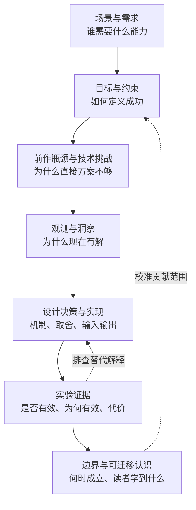

# MobiCom / SenSys 写作 Skill 调研与逻辑链设计

调研日期：2026-09-10。范围：GitHub 上可读取的写作、审稿与会议适配 skill，辅以会议官方材料交叉核验。这是定向样本比较，不是 GitHub 全量普查，也不是对这些 prompt 录用效果的实证评测。

## 1. 检索与样本

检索包括 `site:github.com "MobiCom" "SKILL.md"`、`site:github.com "SenSys" "SKILL.md"` 及 writing / reviewer 组合；随后克隆三个仓库，读取实际 prompt 和 systems reference，而不只看 README。未运行外部仓库代码，也没有安装其技能。

| 仓库与本次版本 | 实际核对的模块 | 与本任务关系 |
| :--- | :--- | :--- |
| [drunkcoding/AgentSkillsArxiv](https://github.com/drunkcoding/AgentSkillsArxiv/tree/b384c0ccbe7a33f80c0a339ee23eeab6a39c4d53) | academic-writing、systems_paper_structure、academic-reviewer、academic-rebuttal | 明确覆盖 MobiCom 的系统论文写作 / 审稿 / 回复闭环，不是 SenSys 专用指南 |
| [SimonZeng7108/ccf-conference-skills](https://github.com/SimonZeng7108/ccf-conference-skills/tree/92cf3b5313ad12eb2113fbfb86e2131bbc67673b) | mobicom、sensys | 两个会议均有独立 SKILL.md，以格式、模板与会议写作习惯为主 |
| [brycewang-stanford/Awesome-Journal-Skills](https://github.com/brycewang-stanford/Awesome-Journal-Skills/tree/36b2bbb357fa51c258311028af66721b5cf99347) | Computer-Science-Conference-Skills 下的 acm-mobicom | 会议匹配、贡献定位、证据差距和投稿风险；其中提及 SenSys 作为相邻会议，不能算 SenSys 专用 skill |

以下源文件链接固定到本次 commit，便于复查；官方规则则是访问当日的网页快照事实。

## 2. 各自的特色与取舍

### A. AgentSkillsArxiv：从写作到审稿再到回复

- **写作特色**：区分系统论文与 AI/ML 论文，把系统正文组织为问题、设计、实现、评估；强调动机有测量、设计解释取舍、引言承诺有结果支撑，并建议先写设计与实验再回写摘要。[academic-writing](https://github.com/drunkcoding/AgentSkillsArxiv/blob/b384c0ccbe7a33f80c0a339ee23eeab6a39c4d53/skills/academic-writing/SKILL.md)、[systems reference](https://github.com/drunkcoding/AgentSkillsArxiv/blob/b384c0ccbe7a33f80c0a339ee23eeab6a39c4d53/skills/academic-writing/references/systems_paper_structure.md)
- **审稿特色**：从新颖性、正确性、意义、评估、清晰度等维度检查，以具体位置、严重性和修复建议描述问题。适合把“感觉实验弱”转换为“哪条贡献缺哪项证据”。[academic-reviewer](https://github.com/drunkcoding/AgentSkillsArxiv/blob/b384c0ccbe7a33f80c0a339ee23eeab6a39c4d53/skills/academic-reviewer/SKILL.md)
- **回复特色**：区分误解、真实弱点、直接问题和小澄清；纠正误解前先重读论文，检查是否是作者表达造成的，并围绕证据组织回复。[academic-rebuttal](https://github.com/drunkcoding/AgentSkillsArxiv/blob/b384c0ccbe7a33f80c0a339ee23eeab6a39c4d53/skills/academic-rebuttal/SKILL.md)
- **采用**：贡献到实验的追踪、设计理由、审稿问题分级、对作者自身表述的反查。
- **不照搬**：固定段落 / 页数分配、把 Related Work 的位置当硬规则、强制依赖另一个 humanizer。该版本写作表中的 MobiCom 页数为 15，与 2026 官网的 12 页正文上限不同；即使其提醒逐年核验，表格仍不能直接作为投稿依据。

### B. ccf-conference-skills：可快速使用的会议操作清单

- **MobiCom**：独立给出 LaTeX、匿名投稿与 camera-ready 清单，配合无线系统原型、硬件与现场实验示例。[mobicom/SKILL.md](https://github.com/SimonZeng7108/ccf-conference-skills/blob/92cf3b5313ad12eb2113fbfb86e2131bbc67673b/ccf-conference-skills/mobicom/SKILL.md)
- **SenSys**：在类似结构上突出传感节点、能耗分解、部署周期、ground truth 和敏感性评估。[sensys/SKILL.md](https://github.com/SimonZeng7108/ccf-conference-skills/blob/92cf3b5313ad12eb2113fbfb86e2131bbc67673b/ccf-conference-skills/sensys/SKILL.md)
- **采用**：把实现平台、能量口径、真实场景和可检查输出变成输入字段，减少写作时遗漏。
- **不照搬**：示例中的性能数字不属于用户论文；模板中的会议信息必须复核。具体冲突包括 MobiCom 的 9pt 描述与官网 10pt 最低字号不同，以及 SenSys 的一般性“附录允许且不计页数”与 2026 CFP 不同。后者仅对指定重投回复附录设置例外。
- **判断**：它更像投稿与格式助手，不能单独承担机制归因、创新边界或完整证据链审计。

### C. Awesome-Journal-Skills：先判断论文为什么适合这个会议

- 把 MobiCom skill 明确定位为选会 / 重定位工具，要求区分工程工作量与研究贡献，并让实验回答研究问题。
- 给出移动无线约束、相邻会议比较、最重要证据缺口与官方规则待核验项；年度规则冲突时以官网为准。[acm-mobicom/SKILL.md](https://github.com/brycewang-stanford/Awesome-Journal-Skills/blob/36b2bbb357fa51c258311028af66721b5cf99347/Computer-Science-Conference-Skills/skills/acm-mobicom/SKILL.md)
- **采用**：先声明贡献类型与场景，区分可复用写作方法和逐届投稿规定。
- **不照搬**：其 MobiCom / MobiSys 分流比较刚性，也把一些科研质量问题放在 desk-reject 标题下。本项目不把“证据不足”一律说成行政拒稿，不把感知 / 端到端系统简单排除在 MobiCom 外。

## 3. 用官方材料纠偏

### MobiCom

2026 CFP 同时强调分析、设计、原型与实证，也承认新概念可能尚未充分开发。其征稿主题包括感知、可穿戴和移动应用，不只底层无线。该届正文上限为 12 页、最低字号 10pt；rebuttal 限 500 词，只澄清已投稿工作，不得加入新实验、数据、图或追加工作承诺。[MobiCom 2026 CFP](https://www.sigmobile.org/mobicom/2026/cfp.html)

**落实**：证据义务跟着论文实际主张走，而不是所有论文都强制大规模部署；内部补实验计划不能直接复制到该届 rebuttal 中。

### SenSys

SenSys 2026 合并原 SenSys、IPSN、IoTDI 社区，覆盖 sensing systems 与 embedded AI。CFP 包含理论基础、平台、信息处理、应用和 Experience；Experience 短文有独立评估说明，不能用单一原型论文模板覆盖所有类型。[SenSys 2026 CFP](https://sensys.acm.org/2026/cfp.html)

**落实**：核对目标年份和 track，按感知任务追问物理输入、参考真值、资源约束与最终效用，但不强制所有论文都包含硬件或长期部署。

### 可复现性

MobiCom 2026 artifact 评估面向已录用论文，检查相关材料的完整性、文档、功能及可复现性。[官方 Artifact CFP](https://www.sigmobile.org/mobicom/2026/artifact_cfp.html)

**落实**：提前组织 claim、图表、数据、配置和脚本的对应关系；这不等于所有投稿都必须拿到 artifact badge，也不能把有代码链接当作结果已复现。

以上是有年份的调研结果，不是后续年度默认规则。实际投稿时重新打开目标届官方文件；无法核验就记录未知，不猜测。

## 4. 本项目总结的写作逻辑链

下面是综合上述方法与本项目需求形成的设计建议，不是任何会议发布的固定写作标准。

关键不是链条长，而是连接能被检查：

| 逻辑连接 | 检查动作 | 交付物 |
| :--- | :--- | :--- |
| 场景 -> 目标 | 指标是否对应用户任务，阈值来自哪里？ | Scenario / Objective |
| 前作 -> 挑战 | 是假设、能力还是成本不满足需求？ | 有来源的 gap 与 H ID |
| 挑战 -> 洞察 | 哪个事实使问题可解，而非仅换了模块名？ | 观测 / 分析与来源 |
| 洞察 -> 设计 | 为什么该机制能利用它，替代方案为什么不够？ | D ID、取舍与输入输出 |
| 模型 -> 决策 | 推导结果用于哪个参数、估计量或解释？ | 模型用途与符号交接 |
| 设计 -> 实验 | 如何区分机制贡献与资源增加等替代解释？ | E ID、对照与剩余混杂 |
| 实验 -> 贡献 | 结果支持的范围是否小于摘要声称的范围？ | Claim-Evidence Ledger |
| 边界 -> 认识 | 是可调工程变量、机制局限还是尚不知道？ | B ID、来源与适用范围 |

### 写作顺序与阅读顺序分开

读者需要先理解问题；作者可以先整理 Design / Evaluation 的真实材料，再写引言贡献，最后压缩摘要。这能减少先写强承诺、后找实验支撑的倒置。已有全文则从引言提取承诺，反向检查设计和实验，不强制重写所有章节。

### 每段都要有工作，但不用同一个模板

重要段落应让读者知道本段回答哪个问题、依据是什么、结论怎么得到、下文为什么继续。Design 尤其检查输入输出与符号交接；Evaluation 不能停留在复述图中数字。术语稳定比同义替换更重要。

## 5. BLE 短距实验：与上中下三策连接

以下是逻辑示例，未提供真实论文数据，不代表某个系统已经完成验证。

**输入事实**：作者报告 BLE 吞吐提升，目前只做短距实验，尚未提供具体配置、对照和原始结果。

1. **先拆 claim**：C1 是给定条件下的吞吐收益；C2 若为“更安全”，需要额外的威胁模型和证据；C3 若为“可扩展至远距”，需要范围或链路分析。C1 的数据不能自动支持 C2 / C3。
2. **再查机制**：吞吐提升是否来自协议机制，还是带宽、发射功率、包长、连接参数或重传条件不同？现有摘要信息不足，先记录缺口。
3. **上策**：若用户任务确实是短距交互，可以说明评估场景与目标一致。但“只测得近”不等于“物理上只能近”，也不推出“远处不能窃听”。安全收益必须独立验证。
4. **中策**：沿距离变化检查信道、重传与机制收益，区分控制变量和不可避免的权衡。记录已测范围、模型估计范围、理论边界；没有数字来源时写 `unknown` 和测量计划，不凭空给优化上限。
5. **下策**：依据已有证据解释当前范围，必要时缩小主张；把补实验计划与可提交回复分开。MobiCom 2026 rebuttal 的具体约束见上文，不复制通用“we will add experiments”句式。

可用的保守段落只描述已知的测试范围，不能虚构收益或安全性：

> Our evaluation is limited to short-range links. Performance at longer distances and any security benefit remain unverified.

这两句仍不能代替核心吞吐证据。是否可以进一步说“局限不影响核心机制”，必须等公平对照与机制分析支持之后再决定。

## 6. 已落地到本仓库

- [统一 skill 入口](../../SKILL.md)：按写作 / 逻辑审计 / 防御性预审 / 语法任务加载。
- [systems-paper-logic-agent](../../.ai_context/prompts/15_systems_paper_logic_agent.md)：逻辑链、章节契约、机制归因、证据边界。
- [论证工作表](../../.ai_context/systems_paper_logic_template.md)：C/H/D/E/B 关联、来源、缺口与修复动作。
- 既有 Outline、Writer、Router、Coordinator、Compactor、Reviewer 接入同一工作表；不建设重复的记忆数据库。
- 既有防御性 Agent 保留三策，补上证据门槛、优化边界类型与目标届回复规则。

本次为独立整理与实现，没有复制外部 skill 的整段 prompt 或示例实验数值。来源固定版本用于归因与复查，不对外部仓库后续版本作保证。

验证范围与可复测的合成输入见 [前向测试用例](../../tests/systems_paper_logic_cases.md)。
